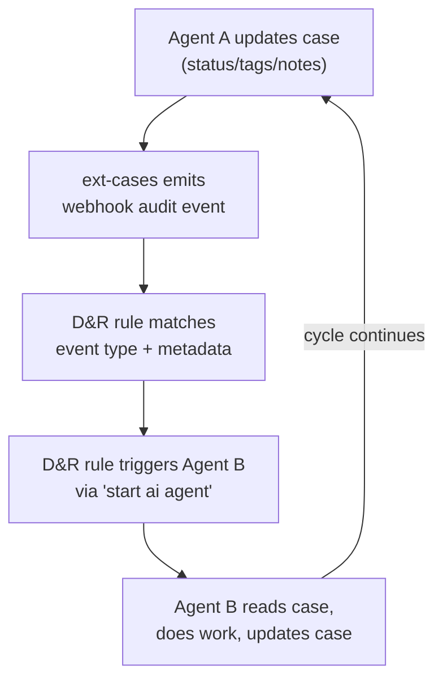

# LimaCharlie Agentic SOC as Code

Fully autonomous Security Operations Centers defined as code -- AI agents coordinated through LimaCharlie's cases system and D&R rules, deployed and versioned like any other Infrastructure as Code.

Each SOC is a self-contained collection of AI agents that work together to detect, triage, investigate, contain, and report on security threats -- without human intervention for routine operations.

## How It Works

Unlike standalone agents that operate independently, SOC agents form a **coordinated pipeline**. They communicate through the cases system: when one agent updates a case (changes status, adds a tag, writes a note), the ext-cases webhook emits an audit event that D&R rules match on to trigger the next agent in the chain.

This event-driven architecture means agents are:

- **Loosely coupled** -- each agent has a single responsibility and doesn't know about other agents' internals
- **Independently deployable** -- add or remove agents without changing the others
- **Observable** -- the case audit trail is the complete activity log
- **Cost-controlled** -- rate limiting via D&R suppression prevents runaway costs

## Available SOCs

| SOC | Agents | Best For | Cost/Alert (typical) |
|-----|--------|----------|---------------------|
| [Tiered SOC](tiered-soc/) | 8 | Full-featured orgs wanting defense-in-depth | $0.10 - $7.60 |
| [Lean SOC](lean-soc/) | 4 | Smaller orgs or getting started fast | $0.10 - $2.10 |
| [Baselining SOC](baselining-soc/) | 7 | New orgs with noisy detections, deploy before Tiered SOC | ~$5.00/hour (bulk) |
| [Intel SOC](intel-soc/) | 3 | Automated daily threat intel collection and detection engineering | ~$5.50/day |

## Inter-Agent Communication

Agents signal each other through two mechanisms:

### 1. Case Status Changes

Status transitions emit specific event types that D&R rules match on:

| Status Transition | Event Type | Typical Use |
|-------------------|------------|-------------|
| New case created | `case_created` | Trigger investigation |
| Status changed | `case_status_changed` | Track lifecycle transitions |
| Case resolved | `case_resolved` | Trigger verification |

### 2. Case Tags

Tags are the primary signaling mechanism between agents. When an agent adds a tag, a `tags_updated` event fires with `metadata.new_tags` containing the updated tag list:

| Tag | Meaning | Triggers |
|-----|---------|----------|
| `investigating` | L1 investigation in progress | (lock -- prevents duplicate work) |
| `analyzing` | Specialist analysis in progress | (lock) |
| `needs-malware-analysis` | Binary found that needs forensics | Malware analyst |
| `needs-containment` | Confirmed threat, take action | Containment agent |
| `needs-threat-hunt` | IOCs confirmed, hunt org-wide | Threat hunter |

### Loop Prevention

Several mechanisms prevent infinite loops:

1. **Tag discipline** -- agents remove trigger tags after processing and add completion tags (e.g., `needs-malware-analysis` -> `malware-analyzed`)
2. **Status progression** -- status only moves forward through the lifecycle
3. **Idempotent keys** -- D&R suppression keys prevent duplicate sessions per case
4. **Rate limiting** -- suppression on all D&R rules caps agent spawning
5. **Debounce** -- `debounce_key` serializes sessions so only one runs at a time per key, with pending requests re-fired on completion (unlike suppression which drops excess requests)
6. **SOC Manager** -- detects stale lock tags and cleans them up (Tiered and Baselining SOCs)

## Prerequisites

All SOCs require:

- [ext-cases](https://doc.limacharlie.io/docs/extensions/ext-cases) extension subscribed and configured
- An Anthropic API key (shared across all agents in a SOC)
- Per-agent LimaCharlie API keys with minimal permissions (documented per agent)

## Installation

Use the `lc-deployer` skill from the [lc-essentials](../marketplace/plugins/lc-essentials/) plugin to deploy SOC definitions and agents.

Each SOC's README contains the full list of agents and their installation order.
