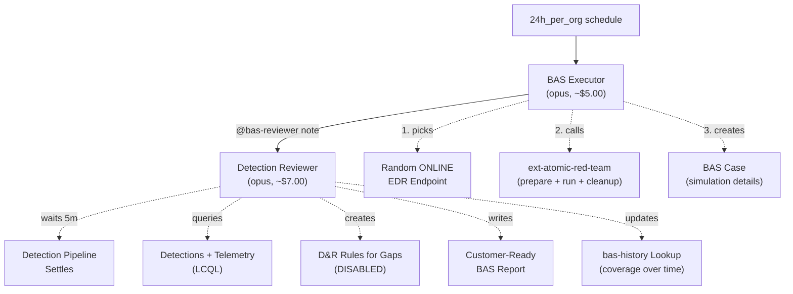

# BAS Team - Automated Breach & Attack Simulation

A 2-agent pipeline that runs daily to execute realistic attack simulations using Atomic Red Team (MITRE ATT&CK), evaluate detection coverage, engineer rules for gaps, and produce customer-ready BAS reports.

## Architecture



## How It Works

| Step | Agent | What Happens |
|------|-------|-------------|
| 1 | **BAS Executor** | Picks a random online endpoint (rotating daily), selects a coherent attack scenario, executes 3-6 MITRE ATT&CK techniques via ext-atomic-red-team, cleans up the endpoint |
| 2 | **Detection Reviewer** | Waits for detections to settle, maps detections to techniques, identifies gaps, engineers D&R rules for detectable gaps, produces a comprehensive BAS report |

### Attack Scenarios

The executor composes realistic multi-step attack chains, not random individual techniques. It rotates through 6 scenario themes:

| Theme | Kill Chain | Example Techniques |
|-------|-----------|-------------------|
| Ransomware Intrusion | Discovery -> Credential Access -> Lateral Movement -> Impact | T1082, T1003.001, T1021.002, T1486 |
| APT Data Theft | Execution -> Persistence -> Collection -> Exfiltration | T1059.001, T1053.005, T1560.001, T1048.003 |
| Credential Theft & Escalation | Credential Access -> Privilege Escalation -> Defense Evasion | T1003.001, T1003.003, T1134.001, T1070.004 |
| Living Off The Land | Execution -> Discovery -> Defense Evasion -> Persistence | T1059.001, T1082, T1218.011, T1547.001 |
| Reconnaissance & Collection | Discovery -> Execution -> Collection | T1082, T1057, T1049, T1005, T1560.001 |
| Defense Evasion Focus | Multiple evasion techniques | T1218.011, T1218.010, T1027, T1070.004 |

The executor tracks which techniques and sensors were recently tested via the `bas-history` lookup, prioritizing untested areas for maximum coverage over time.

### What Gets Created

- **BAS Case** (INFO severity) — contains simulation details, detection scorecard, gap analysis, new rules, historical trend, and MDR-ready recommendations
- **D&R Rules** — created **DISABLED** for each detectable gap, with names like `bas-t1003-lsass-access`. A human reviews and enables them.
- **BAS History** (`bas-history` lookup) — tracks every simulation: date, target, techniques, coverage percentage, rules created. Enables trend reporting.

### Customer-Ready Reporting

The BAS report is structured for MDR providers to share directly with their customers:
- Executive summary with coverage percentage
- Detection scorecard with per-technique pass/fail and mean time to detect
- Gap analysis with root causes and remediation steps
- Historical coverage trend (improving / stable / declining)
- Actionable recommendations

## Inter-Agent Communication

| Signal | Meaning | Written By | Triggers |
|--------|---------|------------|----------|
| `@bas-reviewer` note | Simulation complete, ready for review | Executor | Reviewer |

**Tags:**

| Tag | Meaning | Added By |
|-----|---------|----------|
| `bas-simulation` | Marks case as a BAS run | Executor |
| `bas-pending-review` | Waiting for Detection Reviewer | Executor |
| `bas-reviewing` | Review in progress (lock) | Reviewer |
| `bas-complete` | Review finished | Reviewer |
| `bas-rules-pending-review` | New D&R rules need human review | Reviewer |
| `bas-cleanup-failed` | Endpoint cleanup failed (manual action needed) | Executor |
| `bas-exclude` | Sensor tag to opt out of BAS testing | Operator |

## Cost Profile

| Agent | Model | Budget | Typical Cost |
|-------|-------|--------|-------------|
| BAS Executor | opus | $8.00 | ~$5.00 |
| Detection Reviewer | opus | $10.00 | ~$7.00 |
| **Total per day** | | **$18.00 max** | **~$12.00** |

Note: The BAS Executor has a 30-minute TTL due to waiting for ART preparation, test execution, and cleanup. Most of the budget is consumed by the agent's reasoning, not the wait time.

## Prerequisites

1. **ext-atomic-red-team** extension must be subscribed — this is the core testing engine
2. **ext-reliable-tasking** extension must be subscribed — used internally by ext-atomic-red-team
3. **ext-cases** extension must be subscribed — for case management
4. **Anthropic API key** with access to Claude Opus
5. **Per-agent LimaCharlie API keys** with appropriate permissions (see below)
6. At least one **online EDR sensor** (Windows, Linux, or macOS)

## API Key Permissions

### bas-executor

| Permission | Why |
|-----------|-----|
| `org.get` | Basic org context |
| `sensor.list` | List sensors to pick target |
| `ext.request` | Call ext-atomic-red-team (prepare, run, cleanup) |
| `ext.conf.get` | Verify ext-atomic-red-team is subscribed |
| `investigation.get` | List/read cases |
| `investigation.set` | Create cases, add notes, tags |
| `lookup.get` | Read `bas-history` ledger |
| `lookup.set` | Update `bas-history` ledger |
| `org_notes.*` | Read and write org notes |
| `sop.get` | Read SOPs |
| `sop.get.mtd` | Read SOP metadata |
| `ai_agent.operate` | Allow the agent to run |
| `ai_agent.exec` | Trigger Detection Reviewer via @mention |

### bas-reviewer

| Permission | Why |
|-----------|-----|
| `org.get` | Basic org context and event schema access |
| `sensor.list` | Get sensor details for the target |
| `insight.evt.get` | Query telemetry via LCQL |
| `insight.det.get` | Query detections via `detection list` |
| `dr.list` | Check existing D&R rules |
| `dr.set` | Create new D&R rules (disabled) |
| `dr.del` | Delete rules if needed (e.g., replacing a flawed rule) |
| `fp.set` | Create FP rules if needed |
| `investigation.get` | Read the BAS case |
| `investigation.set` | Update case with report, tags |
| `lookup.get` | Read `bas-history` |
| `lookup.set` | Update `bas-history` with results |
| `org_notes.*` | Read and write org notes |
| `sop.get` | Read SOPs |
| `sop.get.mtd` | Read SOP metadata |
| `ai_agent.operate` | Allow the agent to run |

## Operator Controls

### Excluding Sensors

Tag any sensor with `bas-exclude` to permanently opt it out of BAS testing:
```bash
limacharlie sensor tag add --sid <sid> -t bas-exclude --oid <oid>
```

### Custom SOPs

Create SOPs to customize BAS behavior:

| SOP Key | Effect |
|---------|--------|
| `bas-approved-techniques` | Restrict testing to a specific list of technique IDs |
| `bas-excluded-techniques` | Blacklist specific techniques (e.g., T1486 Data Encryption) |
| `bas-preferred-platform` | Focus testing on a specific platform |
| `bas-schedule-override` | Custom scheduling notes |

### Reviewing Created Rules

After each BAS run with gaps, check for cases tagged `bas-rules-pending-review`. Review the rules in the D&R Rules page and enable ones you approve.

## Installation

Deploy via the `lc-deployer` skill:
```
/lc-deployer install bas-team to <org>
```

Or manually with `limacharlie sync push`:
```bash
limacharlie sync push --oid <oid> --input bas-team.yaml
```

**Important**: Ensure `ext-atomic-red-team` and `ext-reliable-tasking` are subscribed before deploying.

## Files

```
bas-team/
├── README.md                          # This file
├── bas-team.yaml                       # Master include file
├── bas-executor/
│   ├── README.md                      # Executor agent docs
│   └── hives/
│       ├── ai_agent.yaml              # Agent definition (daily schedule)
│       ├── dr-general.yaml            # 24h schedule trigger
│       └── secret.yaml                # API key placeholders
└── detection-reviewer/
    ├── README.md                      # Reviewer agent docs
    └── hives/
        ├── ai_agent.yaml              # Agent definition (@bas-reviewer trigger)
        └── dr-general.yaml            # @mention trigger
```
