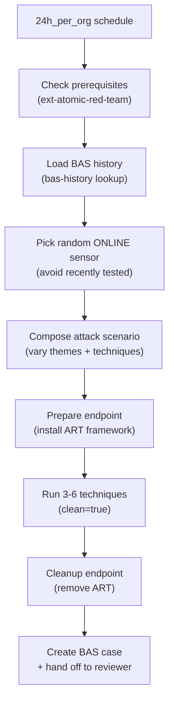

# BAS Executor - Daily Attack Simulation Runner

The entry point of the BAS pipeline. Runs once per day on a schedule, selects a random online endpoint, composes a realistic attack scenario, executes it via ext-atomic-red-team, and creates a case for the Detection Reviewer.

## What It Does

## Why Opus

Composing realistic, varied attack scenarios requires understanding of MITRE ATT&CK, real-world attack campaigns, and the ability to reason about which techniques complement each other in a kill chain.

## TTL Consideration

This agent has a 30-minute TTL (1800s), significantly longer than most agents, because it waits for:
- ART framework installation (~5 minutes)
- Test execution (~3 minutes per technique)
- Cleanup (~2 minutes)

Most of the TTL is spent sleeping while the extension does its work.

## API Key Permissions

Create an API key named `bas-executor` with:

| Permission | Why |
|-----------|-----|
| `org.get` | Basic org context |
| `sensor.list` | List sensors to pick target |
| `ext.request` | Call ext-atomic-red-team (prepare, run, cleanup) |
| `ext.conf.get` | Verify ext-atomic-red-team is subscribed |
| `investigation.get` | List/read cases |
| `investigation.set` | Create cases, add notes, tags |
| `lookup.get` | Read `bas-history` ledger |
| `lookup.set` | Update `bas-history` ledger |
| `org_notes.*` | Read and write org notes |
| `sop.get` | Read SOPs |
| `sop.get.mtd` | Read SOP metadata |
| `ai_agent.operate` | Allow the agent to run |
| `ai_agent.exec` | Trigger Detection Reviewer via @mention |

## Configuration

| Parameter | Value |
|-----------|-------|
| `model` | `opus` |
| `max_budget_usd` | `8.00` |
| `max_turns` | `150` |
| `ttl_seconds` | `1800` (30m) |
| Trigger | `24h_per_org` schedule |
| Debounce | `bas-executor` (one at a time) |

## Files

- `hives/ai_agent.yaml` - Agent definition
- `hives/dr-general.yaml` - D&R rule: triggers on daily schedule
- `hives/secret.yaml` - Placeholder secrets (shared across both BAS agents)
