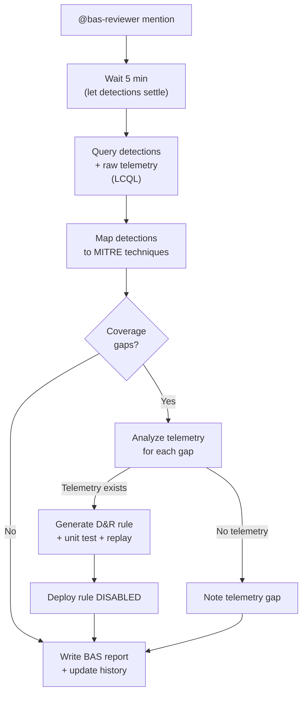

# Detection Reviewer - Coverage Analysis & Rule Engineering

The second stage of the BAS pipeline. Triggered after the BAS Executor completes a simulation, it evaluates detection coverage, engineers rules for gaps, and produces a customer-ready BAS report.

## What It Does

## Why Opus

Detection gap analysis and rule engineering require deep reasoning about event schemas, detection logic, and false positive patterns. The reviewer must also produce customer-ready reports with actionable insights.

## Key Design Decisions

### Rules Created Disabled
All D&R rules are created disabled. BAS-generated rules are based on simulation telemetry — a human should verify they are appropriate for the production environment before enabling.

### Replay Validation
Before deploying a rule, the reviewer replays it against 24 hours of historical data with a `__test-` prefix to check for false positives. This mirrors the MDR Detection Engineer's validation workflow.

### Customer-Ready Reporting
The BAS report includes an executive summary, detection scorecard with MTTD, gap analysis, and historical trend. MDR providers can share it directly with their customers.

### Historical Tracking
The `bas-history` lookup accumulates results from every simulation, enabling coverage trend reporting that shows security posture improvement over time.

## API Key Permissions

Create an API key named `bas-reviewer` with:

| Permission | Why |
|-----------|-----|
| `org.get` | Basic org context and event schema access |
| `sensor.list` | Get sensor details |
| `insight.evt.get` | Query detections and telemetry via LCQL |
| `dr.list` | Check existing D&R rules |
| `dr.set` | Create new D&R rules (disabled) |
| `dr.del` | Delete `__test-` rules after replay |
| `fp.set` | Create FP rules if needed |
| `investigation.get` | Read the BAS case |
| `investigation.set` | Update case with report |
| `lookup.get` | Read `bas-history` |
| `lookup.set` | Update `bas-history` |
| `org_notes.*` | Read and write org notes |
| `sop.get` | Read SOPs |
| `sop.get.mtd` | Read SOP metadata |
| `ai_agent.operate` | Allow the agent to run |

## Configuration

| Parameter | Value |
|-----------|-------|
| `model` | `opus` |
| `max_budget_usd` | `10.00` |
| `max_turns` | `100` |
| `ttl_seconds` | `900` (15m) |
| Trigger | `@bas-reviewer` mention |
| Suppression | 1 per case per 30m |

## Files

- `hives/ai_agent.yaml` - Agent definition
- `hives/dr-general.yaml` - D&R rule: triggers on `@bas-reviewer` mention
