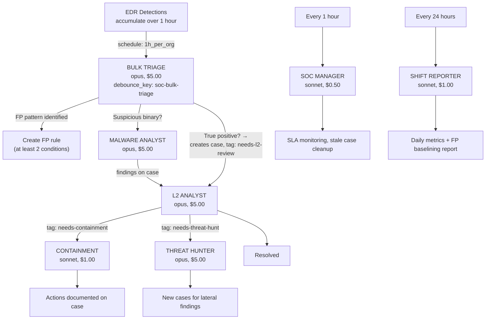

# Baselining SOC

An Agentic SOC as Code designed for **newly onboarded organizations** that generate a high volume of false positive detections. Instead of triaging every detection individually in real-time, it processes detections in hourly batches and aggressively creates narrow FP rules to reduce noise. Once the detection volume is manageable, migrate to the [Tiered SOC](../tiered-soc/) for real-time per-detection handling.

## Architecture

## How It Differs from Tiered SOC

| Aspect | Baselining SOC | Tiered SOC |
|--------|---------------|------------|
| **Entry point** | Hourly bulk triage (schedule event) | Per-detection triage (real-time) |
| **Primary output** | FP rules to reduce noise | Investigated cases |
| **FP handling** | Creates FP rules via `limacharlie fp set` | Dismisses FPs as case closures |
| **Model for triage** | Opus (needs strong reasoning for rule creation) | Sonnet (fast classification) |
| **Triage cost** | ~$5.00/hour (bulk) | ~$0.10/detection |
| **Best for** | Noisy new orgs, first days/weeks | Stable orgs with tuned detections |
| **Downstream pipeline** | Same (L2, containment, hunting, etc.) | Same |

## When to Use

Deploy the Baselining SOC when:
- **New organization onboarding** -- detections are untriaged and noisy
- **New detection rules deployed** -- need to baseline what's normal
- **High alert volume** -- per-detection triage would be too expensive
- **FP rules don't exist yet** -- need to build the baseline config

Migrate to the Tiered SOC when:
- Daily report shows detection volume has stabilized
- FP rule creation rate has slowed (most patterns already covered)
- Remaining detections are higher quality (fewer obvious FPs)
- Shift Reporter recommends migration readiness

## Cost Profile

| Scenario | Agents Involved | Estimated Cost |
|----------|----------------|----------------|
| Hourly bulk triage (FPs only) | bulk-triage | ~$5.00/hour |
| Hourly triage + TP with L2 | bulk-triage + l2 | ~$10.00 |
| TP with malware analysis | bulk-triage + malware + l2 | ~$15.00 |
| TP with containment + hunt | bulk-triage + l2 + containment + hunter | ~$16.00 |
| Daily overhead (scheduled) | soc-manager (24x) + shift-reporter (1x) | ~$13.00/day |

The bulk triage is more expensive per-run than per-detection triage, but processes all detections at once. For noisy orgs with hundreds of FPs per hour, this is significantly cheaper than $0.10-$0.50 per detection.

## Agents

| Agent | Role | Model | Budget | TTL | Trigger |
|-------|------|-------|--------|-----|---------|
| [bulk-triage](bulk-triage/) | Process all detections hourly, create FP rules, escalate TPs | opus | $5.00 | 15m | Schedule: every 1h |
| [l2-analyst](l2-analyst/) | Deep investigation, scope assessment, lateral movement | opus | $5.00 | 15m | Tag: needs-l2-review |
| [malware-analyst](malware-analyst/) | Deep binary forensics via LCRE/Ghidra | opus | $5.00 | 15m | Tag: needs-malware-analysis |
| [containment](containment/) | Isolate sensors, block IOCs | sonnet | $1.00 | 5m | Tag: needs-containment |
| [threat-hunter](threat-hunter/) | Hunt IOCs from confirmed incidents org-wide | opus | $5.00 | 15m | Tag: needs-threat-hunt |
| [soc-manager](soc-manager/) | SLA monitoring, stale case cleanup | sonnet | $0.50 | 5m | Schedule: every 1h |
| [shift-reporter](shift-reporter/) | Daily SOC summary with FP baselining metrics | sonnet | $1.00 | 5m | Schedule: every 24h |

## Installation Order

1. **bulk-triage** -- starts processing detections hourly and creating FP rules
2. **l2-analyst** -- handles escalations from bulk triage
3. **malware-analyst** -- handles malware analysis requests
4. **containment** -- handles containment requests
5. **threat-hunter** -- handles threat hunting requests
6. **soc-manager** -- starts monitoring SLAs
7. **shift-reporter** -- starts generating daily reports with baselining progress

Each agent has its own `secret.yaml` with a shared Anthropic API key and per-agent LimaCharlie API key. Create the API keys first with the permissions documented in each agent's README.

## Migration to Tiered SOC

When the Shift Reporter's daily reports indicate readiness:

1. **Deploy the Tiered SOC** alongside the Baselining SOC (the FP rules persist independently)
2. **Disable the Bulk Triage** D&R rule (`soc-bulk-triage-hourly`)
3. **Verify** the Tiered SOC's per-detection triage is handling the remaining alert volume
4. **Remove the Baselining SOC** hive entries (the FP rules stay -- they're independent)

The FP rules created during baselining are stored in the `dr-fp` hive and survive the SOC transition. They continue suppressing false positives regardless of which SOC is active.

## Tradeoffs

**Strengths:**
- Aggressive FP rule creation rapidly reduces noise on new orgs
- Bulk processing is cost-efficient for high-volume alert streams
- FP rules persist independently of the SOC -- they survive migration
- Same downstream pipeline as Tiered SOC (L2, containment, hunting)
- Daily reports track baselining progress and recommend migration timing

**Weaknesses:**
- Up to 1-hour delay between detection and triage (not real-time)
- Higher per-run cost for bulk triage ($5.00/hour vs $0.10/detection)
- Requires migration to Tiered SOC once baselining is complete
- FP rules need periodic review -- legitimate changes may get suppressed
