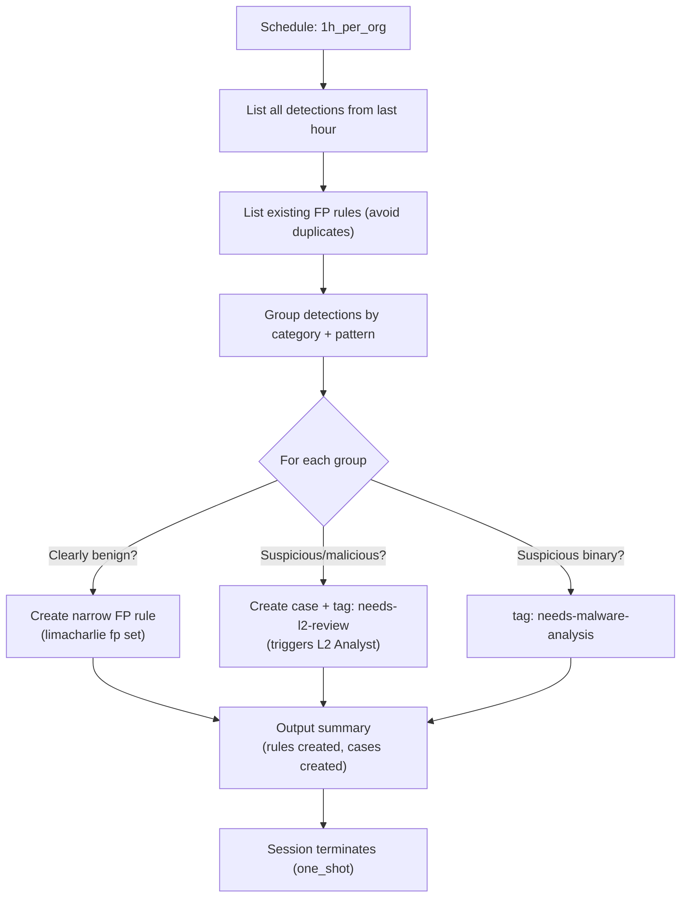

# Bulk Triage - Hourly Detection Processing & FP Rule Creation

The core agent of the Baselining SOC. Instead of triaging individual detections in real-time, it runs every hour to process all detections in bulk, group related ones, investigate each group, and create narrow FP rules for confirmed false positives.

## What It Does

## Why Opus

This agent needs strong reasoning to:
- Analyze detection patterns across many alerts and identify commonalities
- Create FP rules that are narrow enough to avoid suppressing real threats
- Distinguish legitimate system activity from suspicious behavior in bulk
- Determine optimal rule conditions (2-3 conditions per rule)

## API Key Permissions

Create an API key named `soc-bulk-triage` with these permissions:

| Permission | Why |
|-----------|-----|
| `org.get` | Basic org context |
| `sensor.list` | List sensors for context |
| `sensor.get` | Get sensor details |
| `sensor.task` | Task sensors for additional context |
| `dr.list` | List D&R rules for detection context |
| `insight.det.get` | List and read detections (primary input) |
| `insight.evt.get` | Access event data for IOC searches |
| `investigation.get` | List and read existing cases |
| `investigation.set` | Create cases, add detections, add notes |
| `ext.request` | Invoke ext-cases extension |
| `fp.ctrl` | Create, list, and manage FP rules |
| `org_notes.*` | Read and write org notes |
| `sop.get` | Read SOPs for operational guidance |
| `sop.get.mtd` | Read SOP metadata |
| `ai_agent.operate` | Allow the agent to run |

## Configuration

| Parameter | Value | Description |
|-----------|-------|-------------|
| `model` | `opus` | Strong reasoning for FP rule creation |
| `max_turns` | `50` | Enough for bulk processing + rule creation |
| `max_budget_usd` | `5.0` | Cost cap per hourly session |
| `ttl_seconds` | `900` | 15 minute hard timeout |
| `one_shot` | `true` | Terminates after completing |
| `debounce_key` | `soc-bulk-triage` | Only one bulk triage runs at a time |

## FP Rule Philosophy

- **At least 2 conditions** per rule (never match on category alone)
- **Prefer 3 conditions** for maximum specificity (category + path + hostname)
- **Naming convention**: `fp-baseline-<category>-<identifier>-<YYYYMMDD>`
- **Aggressive but precise**: create rules liberally, but keep them narrow
- Rules persist independently of the SOC -- they survive migration to tiered-soc

## Files

- `hives/ai_agent.yaml` - Agent definition with bulk triage + FP creation prompt
- `hives/dr-general.yaml` - D&R rule: triggers on `1h_per_org` schedule event
- `hives/secret.yaml` - Placeholder secrets
