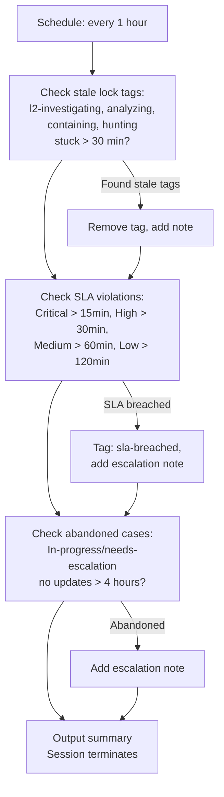

# SOC Manager - Operational Health Monitor

The self-healing mechanism of the SOC. Runs every hour to catch operational issues: stale investigations where agents timed out, SLA violations where cases were missed, and abandoned cases that need human attention.

## What It Does

## Why This Exists

AI agents can fail silently. If an L2 investigation times out at the 15-minute TTL, the `l2-investigating` tag stays on the case forever, and no other agent will pick it up (they see the lock tag and assume someone's working on it). The SOC Manager breaks these deadlocks by cleaning up stale tags after 30 minutes.

It also catches cases that fall through the cracks -- for example, if the D&R suppression rate limit was hit during an alert storm and some cases were never picked up.

## Design Philosophy

The SOC Manager **monitors** but does not **investigate**. It:
- Removes stale tags (so other agents can retry)
- Flags SLA violations (so humans are aware)
- Adds notes (documenting what it found)

It does NOT:
- Change case status
- Close or resolve cases
- Perform any investigation work

## API Key Permissions

Create an API key named `soc-manager` with these permissions:

| Permission | Why |
|-----------|-----|
| `org.get` | Basic org context |
| `investigation.get` | List and read cases, check dashboard |
| `investigation.set` | Add tags, notes to flag issues |
| `ext.request` | Invoke extensions |
| `org_notes.*` | Read and write org notes |
| `sop.get` | Read SOPs for operational guidance |
| `sop.get.mtd` | Read SOP metadata |
| `ai_agent.operate` | Allow the agent to run |

## Configuration

| Parameter | Value | Description |
|-----------|-------|-------------|
| `model` | `sonnet` | Health checks don't need deep reasoning |
| `max_turns` | `30` | Enough to check all case states |
| `max_budget_usd` | `0.50` | Low budget -- mostly listing and tagging |
| `ttl_seconds` | `300` | 5 minute hard timeout |
| `one_shot` | `true` | Terminates after completing |
| Schedule | `1h_per_org` | Runs every hour per organization |

## Files

- `hives/ai_agent.yaml` - Agent definition with monitoring prompt
- `hives/dr-general.yaml` - D&R rule: triggers on `1h_per_org` schedule event
- `hives/secret.yaml` - Placeholder secrets
