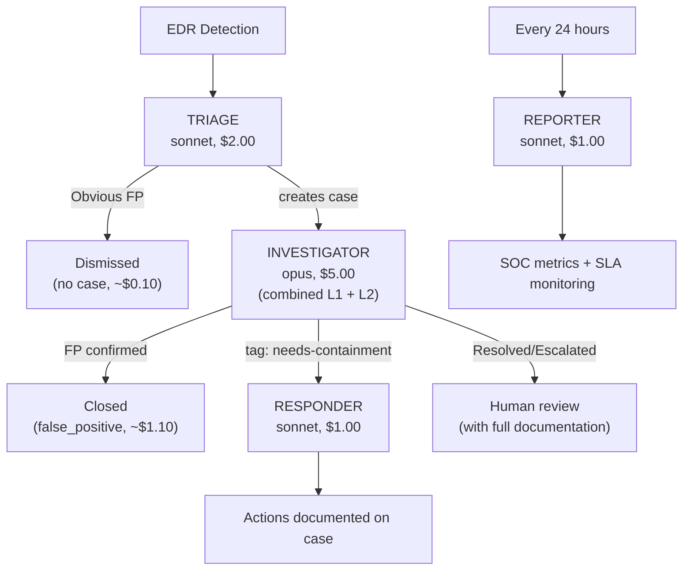

# Lean SOC

A minimal Agentic SOC as Code built for maximum autonomy with minimum complexity. Four agents handle the complete alert lifecycle -- triage, investigation, containment, and reporting -- without the overhead of specialized tiers.

## Architecture

## Why This Structure

The lean model optimizes for simplicity and cost:

- **Fewer moving parts.** Four agents instead of eight means fewer API keys, fewer D&R rules, fewer things that can break. The coordination surface is minimal -- triage creates cases, investigator processes them, responder acts on confirmed threats.
- **One investigator does it all.** Instead of splitting L1 and L2, a single investigator with a higher budget ($5.00) handles the full investigation depth. It pulls timelines, checks process trees, hunts for lateral movement, does scope assessment, and reaches a conclusion -- all in one session. No handoff overhead, no context loss between tiers.
- **Cost-efficient for most workloads.** The majority of alerts are false positives dismissed at triage ($0.10) or after investigation ($1.10). Only confirmed threats trigger the responder ($1.00). For orgs processing hundreds of alerts/day, the lean model can be 30-50% cheaper than the tiered model.
- **Reporter pulls double duty.** The daily reporter also handles SLA monitoring and stale case detection, combining the tiered model's SOC Manager and Shift Reporter into one agent.

## Cost Profile

| Scenario | Agents Involved | Estimated Cost |
|----------|----------------|----------------|
| FP dismissed at triage | triage | ~$0.10 |
| FP dismissed after investigation | triage + investigator | ~$1.10 |
| True positive with containment | triage + investigator + responder | ~$2.10 |
| Daily overhead (scheduled) | reporter | ~$1.00/day |

## Agents

| Agent | Role | Model | Budget | TTL | Trigger |
|-------|------|-------|--------|-----|---------|
| [triage](triage/) | Evaluate every detection, dismiss FPs, create/route cases | sonnet | $2.00 | 5m | Every detection |
| [investigator](investigator/) | Full investigation from triage to conclusion | opus | $5.00 | 15m | Case created |
| [responder](responder/) | Isolate sensors, block IOCs for confirmed threats | sonnet | $1.00 | 5m | Tag: needs-containment |
| [reporter](reporter/) | Daily SOC metrics, SLA monitoring, stale case cleanup | sonnet | $1.00 | 5m | Schedule: every 24h |

## Installation Order

1. **triage** -- starts creating cases from detections
2. **investigator** -- starts investigating cases as they're created
3. **responder** -- handles containment requests
4. **reporter** -- starts generating daily reports

## Tradeoffs

**Strengths:**
- Simple to deploy and maintain (4 agents, 4 API keys, 4 D&R rules)
- Lower daily overhead ($1/day vs $13/day)
- No handoff overhead between L1 and L2 -- single investigator has full context
- Easy to understand and debug the alert flow
- Good starting point -- upgrade to Tiered SOC later by adding specialist agents

**Weaknesses:**
- No specialist agents (malware analysis, threat hunting) -- the investigator does its best but lacks deep forensic tools like LCRE/Ghidra
- Single investigator is a bottleneck during alert storms (rate-limited to 10/min)
- Higher per-investigation cost ($5.00 vs $2.00 for L1-only) since every case gets the full treatment
- No proactive threat hunting -- only reactive investigation
- No hourly SLA monitoring -- only daily checks

## Upgrading to Tiered SOC

The lean SOC is designed as a stepping stone. To upgrade:

1. Replace `investigator` with `l1-investigator` + `l2-analyst` (split the investigation)
2. Add `malware-analyst` for binary forensics
3. Add `threat-hunter` for proactive IOC hunting
4. Add `containment` to replace `responder` (or keep both)
5. Add `soc-manager` for hourly SLA monitoring
6. Replace `reporter` with `shift-reporter` for richer daily reports
