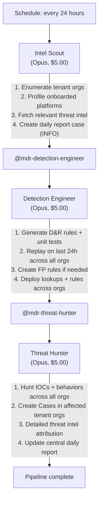

# MDR Hunting Pipeline Team - MSSP Threat Intel & Hunting Pipeline

An AI-powered threat intelligence, detection engineering, and proactive threat hunting pipeline designed for **Managed Security Service Providers (MSSPs)**. This team lives in a central management organization and operates across all tenant organizations accessible via a User API Key.

## Architecture



## MSSP Design

This team is fundamentally different from single-org teams:

| Aspect | Single-Org Teams | MDR Hunting Pipeline |
|--------|-----------------|---------------------|
| **Auth** | Org-level API keys | User API Key + UID (cross-org) |
| **Scope** | One organization | All accessible tenant organizations |
| **Deployment** | Per-org | Central management org only |
| **Intel Filtering** | Single platform profile | Aggregated across all tenants |
| **Rule Deployment** | Local org | Pushed to all relevant tenant orgs |
| **Hunting** | Single org search | Cross-org hunting campaign |
| **Case Creation** | Local cases | Cases in each affected tenant org |
| **Reporting** | Per-org reports | Central daily SOC report for MSSP |

## Pipeline Phases

### Phase 1: Intel Scout

Runs daily on a 24-hour schedule. Creates an INFO-level case in the central org as the daily pipeline report, then:

1. **Enumerates all tenant orgs** accessible via the User API Key
2. **Profiles each org** - what platforms, sensors, extensions, and data sources are onboarded
3. **Fetches threat intel** from public sources, filtered by relevance to onboarded platforms:
   - [CISA KEV](https://www.cisa.gov/known-exploited-vulnerabilities-catalog) - Known Exploited Vulnerabilities
   - [ThreatFox](https://threatfox.abuse.ch/) - IOCs (malware, C2, botnet)
   - [Feodo Tracker](https://feodotracker.abuse.ch/) - C2 infrastructure
   - [DFIR Report](https://thedfirreport.com/) - Detailed intrusion reports
   - [SigmaHQ](https://github.com/SigmaHQ/sigma) - Community detection rules
   - [LOLBAS](https://lolbas-project.github.io/) / [LOLDrivers](https://www.loldrivers.io/) - Living off the land
4. **Documents findings** in the daily report case with structured notes
5. **Hands off** to Detection Engineer via `@mdr-detection-engineer`

### Phase 2: Detection Engineer

Triggered by the Intel Scout's @mention. Reads the intel from the daily report case, then:

1. **Generates D&R rules** using `limacharlie ai generate-detection/response` for each relevant threat
2. **Creates unit tests** - positive tests (must match) and negative tests (must not match)
3. **Replays rules** on the last 24 hours of data across all tenant orgs to validate FP rates
4. **Creates FP rules** for narrow, positively identified false positive corner cases
5. **Deploys lookups** (IOC hashes, domains, IPs) across all tenant orgs - active immediately
6. **Deploys D&R rules** across all tenant orgs - disabled for human review
7. **Documents everything** in the daily report case
8. **Hands off** to Threat Hunter via `@mdr-threat-hunter`

### Phase 3: Threat Hunter

Triggered by the Detection Engineer's @mention. Reads the intel, IOCs, and detection rules from the daily report case, then:

1. **Hunts across all tenant orgs** for active instances of today's threats using LCQL queries
2. **Searches for IOCs** - file hashes, domains, IPs, URLs in the last 7 days of data
3. **Searches for behaviors** - process patterns, lateral movement, persistence mechanisms
4. **Creates detailed Cases** in each affected tenant org containing:
   - Executive summary of the threat
   - Threat intel source with URLs and dates
   - Detection methodology and MITRE ATT&CK mapping
   - Evidence found (events, timelines, affected endpoints)
   - Recommended response actions
   - Reference to the central daily report
5. **Updates the central daily report** with a cross-org findings summary
6. **Closes the daily report** with a comprehensive conclusion

## Daily Report (Central Case)

Every pipeline run creates an INFO-level case in the central org tagged `mdr-daily-report`. This serves as the daily briefing for the MSSP SOC lead:

- **Intel Summary**: What threats were evaluated and why they matter
- **Engineering Summary**: What rules and lookups were created, replay results
- **Hunting Summary**: What was found across tenants, cases created
- **Cross-Org Overview**: Which tenants are affected by which threats

Find daily reports:
```bash
limacharlie case list --tag mdr-daily-report --oid <central-oid> --output yaml
```

## Prerequisites

- **ext-cases** extension subscribed in the central org and all tenant orgs
- **User API Key** with access to all tenant organizations
- **Anthropic API Key** for Claude

## API Key Setup

This team uses a **User API Key** (not org-level API keys) for cross-org access. All three agents share the same credentials:

1. Create a User API Key at [app.limacharlie.io/profile](https://app.limacharlie.io/profile)
2. Ensure the user has appropriate roles in all tenant organizations
3. Store the credentials as secrets in the **central org**:

```bash
# Store the User API Key
echo '{"data": {"secret": "<YOUR-USER-API-KEY>"}, "usr_mtd": {"enabled": true}}' | \
  limacharlie hive set --hive-name secret --key mdr-api-key --oid <central-oid>

# Store the User UID
echo '{"data": {"secret": "<YOUR-USER-UID>"}, "usr_mtd": {"enabled": true}}' | \
  limacharlie hive set --hive-name secret --key mdr-uid --oid <central-oid>

# Store the Anthropic API Key
echo '{"data": {"secret": "<YOUR-ANTHROPIC-API-KEY>"}, "usr_mtd": {"enabled": true}}' | \
  limacharlie hive set --hive-name secret --key anthropic-key --oid <central-oid>
```

### Required Permissions

The User API Key's roles across tenant orgs should include:

| Permission | Why |
|-----------|-----|
| `org.get` | Enumerate orgs and basic context |
| `sensor.list` | Profile onboarded platforms per org |
| `sensor.get` | Get sensor details for platform profiling |
| `insight.evt.get` | Access event data for hunting and replay |
| `insight.det.get` | Access detections for FP analysis |
| `investigation.get` | Read cases |
| `investigation.set` | Create/update cases, add notes, manage tags |
| `dr.list` | Check existing D&R rule coverage |
| `dr.set` | Deploy new D&R rules |
| `fp.set` | Create false positive rules |
| `lookup.get` | Read existing lookups |
| `lookup.set` | Create/update IOC lookups |
| `ext.request` | Invoke extensions |
| `org_notes.*` | Read and write org notes |
| `sop.get` | Read SOPs |
| `sop.get.mtd` | Read SOP metadata |
| `ai_agent.operate` | Allow agents to run |
| `ai_agent.exec` | Allow agents to trigger downstream agents |

## Cost Profile

| Agent | Model | Max Budget | Trigger |
|-------|-------|-----------|---------|
| Intel Scout | Opus | $5.00 | Daily schedule |
| Detection Engineer | Opus | $5.00 | @mention from Intel Scout |
| Threat Hunter | Opus | $5.00 | @mention from Detection Engineer |

**Daily overhead**: ~$15.00/day (worst-case, full pipeline runs once daily)

## Files

```
mdr-hunting-pipeline-team/
├── mdr-hunting-pipeline-team.yaml    # Master include
├── README.md                          # This file
├── intel-scout/
│   ├── README.md
│   └── hives/
│       ├── ai_agent.yaml              # Agent definition + prompt
│       ├── dr-general.yaml            # 24h schedule trigger
│       └── secret.yaml                # Credential placeholders
├── detection-engineer/
│   ├── README.md
│   └── hives/
│       ├── ai_agent.yaml              # Agent definition + prompt
│       ├── dr-general.yaml            # @mention trigger
│       └── secret.yaml                # Credential placeholders
└── threat-hunter/
    ├── README.md
    └── hives/
        ├── ai_agent.yaml              # Agent definition + prompt
        ├── dr-general.yaml            # @mention trigger
        └── secret.yaml                # Credential placeholders
```

## Installation

Use the `lc-deployer` skill to install this team in your central management org:

```
/lc-deployer install mdr-hunting-pipeline-team in <central-org-name>
```

Then configure the secrets as described in [API Key Setup](#api-key-setup).
