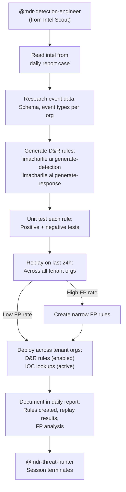

# Detection Engineer - Cross-Org Rule Generation & Testing

The second phase of the MDR Hunting Pipeline. Takes threat intel from the Intel Scout, generates D&R rules with unit tests, replays them across all tenant organizations, and deploys validated rules and IOC lookups.

## What It Does

## MSSP Context

- **Runs in**: Central management org (triggered by @mention)
- **Reads from**: Central org (daily report case) + all tenant orgs (event schema, replay data)
- **Writes to**: All tenant orgs (D&R rules, lookups, FP rules)
- **Auth**: User API Key + UID (cross-org access)

## Rule Deployment Strategy

| Artifact | State | Rationale |
|----------|-------|-----------|
| D&R Rules | **Enabled** | Unit tested and replay validated before deployment |
| IOC Lookups | **Active** | Data-only, matched by existing lookup rules |
| FP Rules | **Active** | Tested and validated, reduces noise immediately |

## API Key Permissions

Uses the shared User API Key (`mdr-api-key`) and UID (`mdr-uid`). Required permissions:

| Permission | Why |
|-----------|-----|
| `org.get` | Basic org context |
| `sensor.list` | Discover platforms for rule targeting |
| `insight.evt.get` | Access event data for replay testing |
| `insight.det.get` | Check existing detections for FP analysis |
| `investigation.get` | Read the daily report case |
| `investigation.set` | Update the daily report case |
| `dr.list` | Check existing D&R rules to avoid duplicates |
| `dr.set` | Deploy new D&R rules |
| `fp.set` | Create false positive rules |
| `lookup.get` | Check existing lookups |
| `lookup.set` | Create/update IOC lookups |
| `ext.request` | Invoke extensions |
| `org_notes.*` | Read and write org notes |
| `sop.get` | Read SOPs |
| `sop.get.mtd` | Read SOP metadata |
| `ai_agent.operate` | Allow the agent to run |
| `ai_agent.exec` | Trigger downstream agents via @mention |

## Configuration

| Parameter | Value | Description |
|-----------|-------|-------------|
| `model` | `opus` | Complex rule generation and FP analysis |
| `max_turns` | `100` | Many rules to generate, test, and deploy across orgs |
| `max_budget_usd` | `10.0` | Higher budget for multi-org rule deployment |
| `ttl_seconds` | `900` | 15 minute hard timeout |
| `one_shot` | `true` | Terminates after completing |
| Suppression | `1/30m per case` | Max one run per case per 30 minutes |

## Files

- `hives/ai_agent.yaml` - Agent definition with detection engineering prompt
- `hives/dr-general.yaml` - D&R rule: triggers on `@mdr-detection-engineer` mention
- `hives/secret.yaml` - Placeholder secrets (User API Key, UID, Anthropic key)
