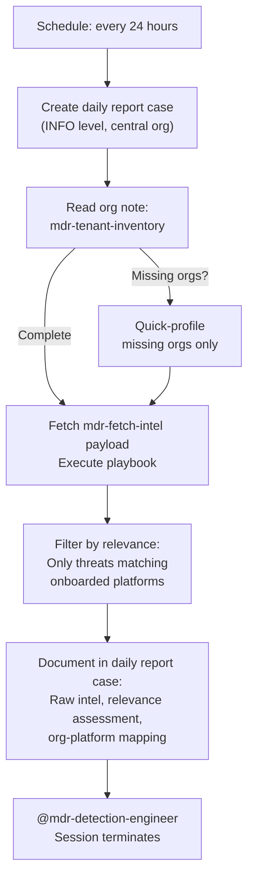

# Intel Scout - Daily MSSP Threat Intelligence Collection

The entry point of the MDR Hunting Pipeline. Runs daily in the central management org, reads the tenant inventory from the Tenant Profiler's org note, executes the `mdr-fetch-intel` playbook to collect public threat intelligence at scale, and produces the daily pipeline report.

## What It Does



## MSSP Context

- **Runs in**: Central management org (schedule trigger)
- **Reads from**: Central org (tenant inventory org note) + playbook payload
- **Writes to**: Central org only (daily report case)
- **Auth**: User API Key + UID (cross-org access)

## Intel Playbook

The `mdr-fetch-intel` payload is a Python script (`fetch_intel.py`) that fetches all intel sources without LLM token limits. It outputs structured JSON with per-source results, IOC counts, and error handling. Upload it during setup:

```bash
limacharlie payload create --name mdr-fetch-intel \
  --path intel-scout/fetch_intel.py --oid <central-oid>
```

The agent falls back to direct `curl` calls if the payload is unavailable.

## Intel Sources

| Source | Data | URL |
|--------|------|-----|
| CISA KEV | Known Exploited Vulnerabilities | https://www.cisa.gov/known-exploited-vulnerabilities-catalog |
| ThreatFox | IOCs (malware, C2, botnet) | https://threatfox.abuse.ch/api/v1/ |
| Feodo Tracker | C2 server IPs | https://feodotracker.abuse.ch/downloads/ipblocklist_recommended.txt |
| DFIR Report | Intrusion analysis reports | https://thedfirreport.com/feed/ |
| LOLBAS | Living Off The Land Binaries | https://lolbas-project.github.io/api/lolbas.json |
| LOLDrivers | Vulnerable/malicious drivers | https://www.loldrivers.io/api/drivers.json |

## API Key Permissions

Uses the shared User API Key (`mdr-api-key`) and UID (`mdr-uid`). Required permissions across tenant orgs:

| Permission | Why |
|-----------|-----|
| `org.get` | Enumerate orgs and read org details |
| `sensor.list` | Profile onboarded platforms (fallback for missing orgs) |
| `ext.request` | Invoke extensions, list extensions |
| `investigation.set` | Create and update the daily report case |
| `org_notes.*` | Read tenant inventory org note |
| `sop.get` | Read SOPs for operational guidance |
| `sop.get.mtd` | Read SOP metadata |
| `ai_agent.operate` | Allow the agent to run |
| `ai_agent.exec` | Trigger downstream agents via @mention |

## Configuration

| Parameter | Value | Description |
|-----------|-------|-------------|
| `model` | `opus` | Complex reasoning for cross-org relevance filtering |
| `max_turns` | `100` | Playbook execution + filtering + documentation |
| `max_budget_usd` | `10.0` | Higher budget for multi-org operations |
| `ttl_seconds` | `900` | 15 minute hard timeout |
| `one_shot` | `true` | Terminates after completing |
| Schedule | `24h_per_org` | Runs every 24 hours |

## Files

- `fetch_intel.py` - Playbook script (upload as `mdr-fetch-intel` payload)
- `hives/ai_agent.yaml` - Agent definition with intel collection prompt
- `hives/dr-general.yaml` - D&R rule: triggers on `24h_per_org` schedule event
- `hives/secret.yaml` - Placeholder secrets (User API Key, UID, Anthropic key)
