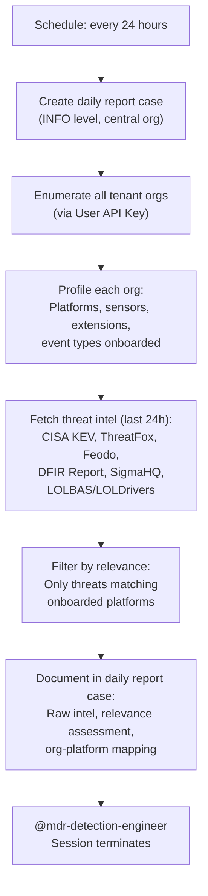

# Intel Scout - Daily MSSP Threat Intelligence Collection

The entry point of the MDR Hunting Pipeline. Runs daily in the central management org, enumerates all tenant organizations, profiles their onboarded platforms, and fetches relevant public threat intelligence. Creates the daily pipeline report case that all downstream agents use.

## What It Does

## MSSP Context

This agent operates across multiple organizations:

- **Runs in**: Central management org (schedule trigger)
- **Reads from**: All tenant orgs (sensor/extension profiling)
- **Writes to**: Central org only (daily report case)
- **Auth**: User API Key + UID (cross-org access)

## Intel Sources

| Source | Data | URL |
|--------|------|-----|
| CISA KEV | Known Exploited Vulnerabilities | https://www.cisa.gov/known-exploited-vulnerabilities-catalog |
| ThreatFox | IOCs (malware, C2, botnet) | https://threatfox.abuse.ch/api/v1/ |
| Feodo Tracker | C2 server IPs | https://feodotracker.abuse.ch/downloads/ipblocklist_recommended.txt |
| DFIR Report | Intrusion analysis reports | https://thedfirreport.com/feed/ |
| SigmaHQ | Community detection rules | https://github.com/SigmaHQ/sigma |
| LOLBAS | Living Off The Land Binaries | https://lolbas-project.github.io/api/lolbas.json |
| LOLDrivers | Vulnerable/malicious drivers | https://www.loldrivers.io/api/drivers.json |

## API Key Permissions

Uses the shared User API Key (`mdr-api-key`) and UID (`mdr-uid`). Required permissions across tenant orgs:

| Permission | Why |
|-----------|-----|
| `org.get` | Enumerate orgs and read org details |
| `sensor.list` | Profile onboarded platforms and sensor types |
| `ext.request` | Invoke extensions for platform discovery |
| `investigation.set` | Create and update the daily report case |
| `org_notes.*` | Read and write org notes |
| `sop.get` | Read SOPs for operational guidance |
| `sop.get.mtd` | Read SOP metadata |
| `ai_agent.operate` | Allow the agent to run |
| `ai_agent.exec` | Trigger downstream agents via @mention |

## Configuration

| Parameter | Value | Description |
|-----------|-------|-------------|
| `model` | `opus` | Complex reasoning for cross-org platform profiling and relevance filtering |
| `max_turns` | `100` | Many orgs to enumerate and sources to fetch |
| `max_budget_usd` | `10.0` | Higher budget for multi-org profiling + intel fetching |
| `ttl_seconds` | `900` | 15 minute hard timeout |
| `one_shot` | `true` | Terminates after completing |
| Schedule | `24h_per_org` | Runs every 24 hours |

## Files

- `hives/ai_agent.yaml` - Agent definition with intel collection prompt
- `hives/dr-general.yaml` - D&R rule: triggers on `24h_per_org` schedule event
- `hives/secret.yaml` - Placeholder secrets (User API Key, UID, Anthropic key)
