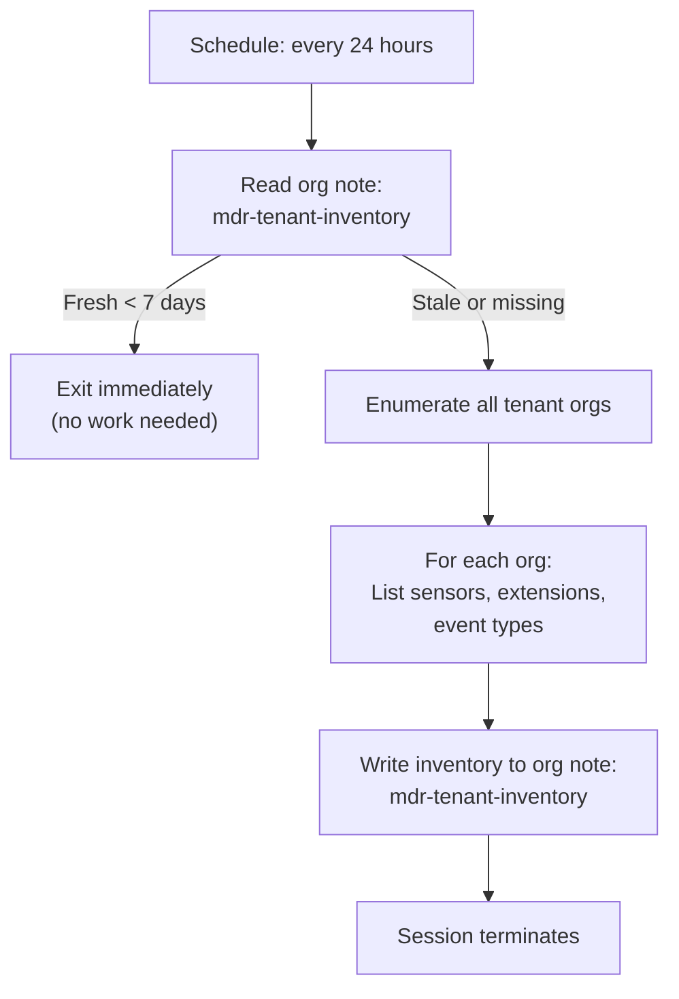

# Tenant Profiler - Weekly Cross-Org Platform Inventory

Maintains a platform inventory of all tenant organizations. Runs on a daily schedule but only performs a full refresh when the inventory is older than 7 days. Stores results as an org note in the central management org so that other pipeline agents can read it without re-profiling.

## What It Does



## MSSP Context

- **Runs in**: Central management org (schedule trigger)
- **Reads from**: All tenant orgs (sensor/extension profiling)
- **Writes to**: Central org only (org note with inventory)
- **Auth**: User API Key + UID (cross-org access)

## Org Note Format

The inventory is stored as the org note `mdr-tenant-inventory` in the central org. It contains a YAML document with:

```yaml
last_updated: "2026-04-01T00:00:00Z"
tenants:
  <oid>:
    name: "<org name>"
    platforms:
      windows: <sensor count>
      linux: <sensor count>
      macos: <sensor count>
    adapters: [<list of adapter types>]
    extensions: [<list of installed extensions>]
```

## API Key Permissions

Uses the shared User API Key (`mdr-api-key`) and UID (`mdr-uid`). Required permissions:

| Permission | Why |
|-----------|-----|
| `org.get` | Enumerate orgs |
| `sensor.list` | Profile sensors per org |
| `ext.request` | List extensions per org |
| `org_notes.*` | Read/write the inventory org note |
| `sop.get` | Read SOPs |
| `sop.get.mtd` | Read SOP metadata |
| `ai_agent.operate` | Allow the agent to run |

## Configuration

| Parameter | Value | Description |
|-----------|-------|-------------|
| `model` | `sonnet` | Lightweight profiling, no deep reasoning needed |
| `max_turns` | `50` | Enough to enumerate and profile many orgs |
| `max_budget_usd` | `2.0` | Low cost -- mostly listing sensors |
| `ttl_seconds` | `600` | 10 minute hard timeout |
| `one_shot` | `true` | Terminates after completing |
| Schedule | `24h_per_org` | Runs daily, skips if inventory is fresh |

## Files

- `hives/ai_agent.yaml` - Agent definition with profiling prompt
- `hives/dr-general.yaml` - D&R rule: triggers on `24h_per_org` schedule event
- `hives/secret.yaml` - Placeholder secrets (User API Key, UID, Anthropic key)
