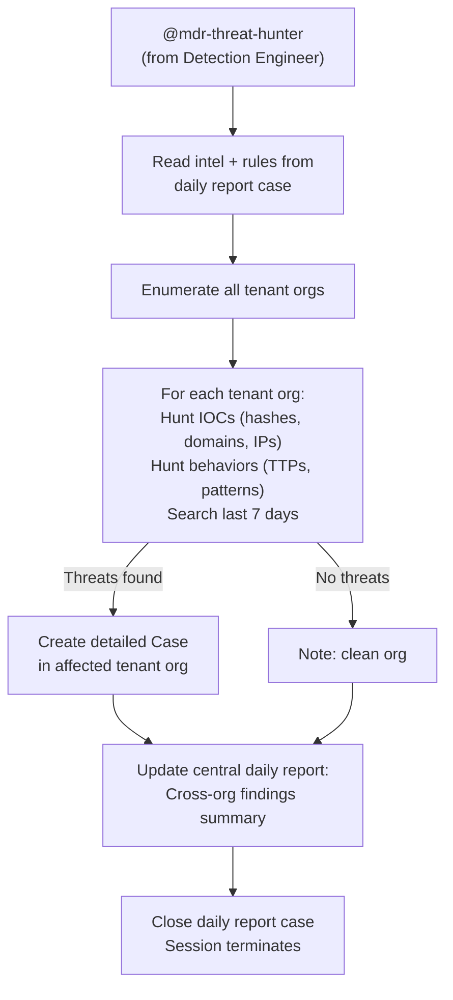

# Threat Hunter - Cross-Org Proactive Hunting & Case Creation

The final phase of the MDR Hunting Pipeline. Takes IOCs, D&R rules, and behavioral patterns from the previous phases and hunts for active threats across all tenant organizations. Creates detailed cases in affected tenant orgs as deliverables for the MSSP's customers.

## What It Does

## MSSP Context

- **Runs in**: Central management org (triggered by @mention)
- **Reads from**: Central org (daily report case)
- **Searches**: All tenant orgs (LCQL queries, event data)
- **Writes to**: Tenant orgs (detailed cases per affected org) + central org (daily report)
- **Auth**: User API Key + UID (cross-org access)

## Customer-Facing Cases

When threats are found in a tenant org, the agent creates a case that serves as an MSSP deliverable:

- **Executive Summary** - What was found, severity, and recommended actions
- **Threat Intelligence** - Source URL, threat description, MITRE ATT&CK mapping
- **Detection Methodology** - How the detection was generated (from which intel source)
- **Evidence** - Specific events, timelines, affected endpoints
- **Response Recommendations** - What the customer should do
- **Reference** - Link back to the central daily report case

This case demonstrates the MSSP's value: proactive hunting found threats before they caused damage.

## API Key Permissions

Uses the shared User API Key (`mdr-api-key`) and UID (`mdr-uid`). Required permissions:

| Permission | Why |
|-----------|-----|
| `org.get` | Basic org context |
| `sensor.list` | List sensors for hunt scope |
| `sensor.get` | Get sensor details for affected endpoints |
| `insight.evt.get` | Access event data for IOC and behavior hunting |
| `insight.det.get` | Check if new rules already triggered detections |
| `investigation.get` | Read the daily report case |
| `investigation.set` | Create cases in tenant orgs, update central report |
| `ext.request` | Invoke extensions |
| `org_notes.*` | Read and write org notes |
| `sop.get` | Read SOPs |
| `sop.get.mtd` | Read SOP metadata |
| `ai_agent.operate` | Allow the agent to run |

## Configuration

| Parameter | Value | Description |
|-----------|-------|-------------|
| `model` | `opus` | Complex hunting and cross-org correlation |
| `max_turns` | `100` | Many orgs to hunt across, many IOCs to search |
| `max_budget_usd` | `5.0` | Higher budget for thorough cross-org hunting |
| `ttl_seconds` | `900` | 15 minute hard timeout |
| `one_shot` | `true` | Terminates after completing |
| Suppression | `1/30m per case` | Max one run per case per 30 minutes |

## Files

- `hives/ai_agent.yaml` - Agent definition with hunting prompt
- `hives/dr-general.yaml` - D&R rule: triggers on `@mdr-threat-hunter` mention
- `hives/secret.yaml` - Placeholder secrets (User API Key, UID, Anthropic key)
