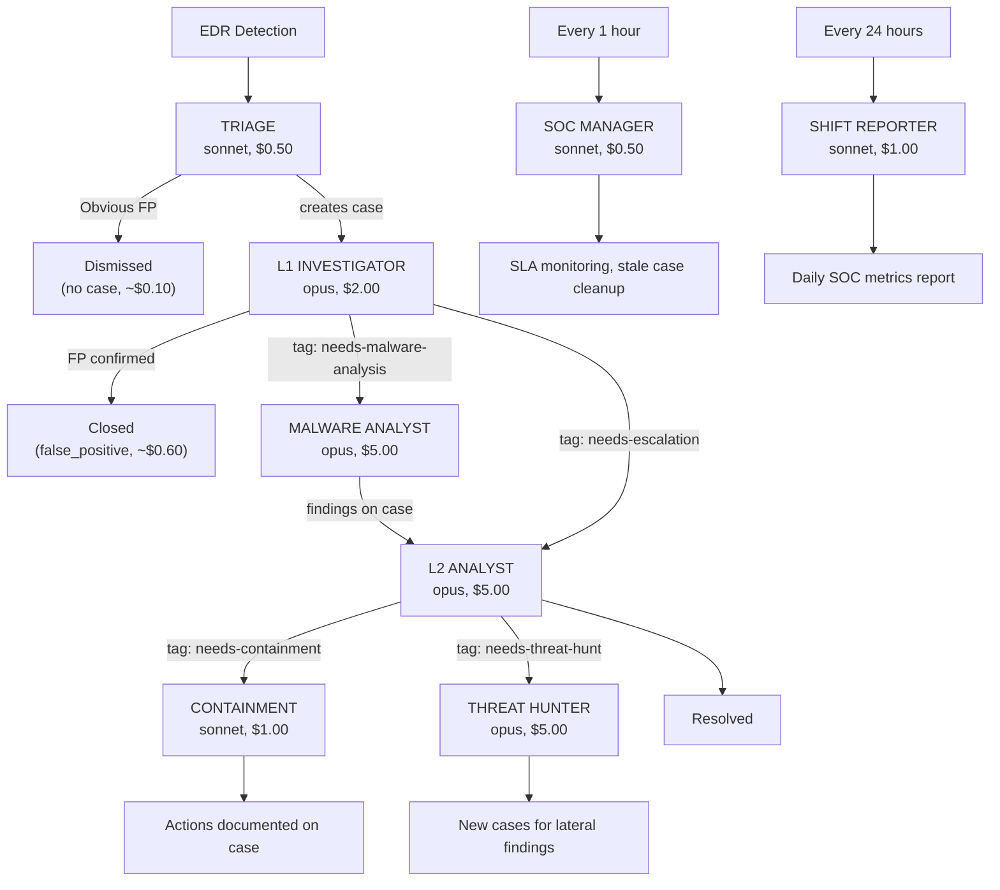

# Tiered SOC

A full-featured Agentic SOC as Code modeled after the traditional L1/L2/L3 SOC structure. Eight specialized agents form a coordinated pipeline that handles the complete alert lifecycle -- from initial detection through investigation, containment, threat hunting, and daily reporting.

## Architecture

## Why This Structure

The tiered model mirrors how elite human SOCs operate, but at machine speed:

- **Triage** handles the firehose. Running on Sonnet keeps cost low (~$0.10/alert) while filtering out noise before it reaches expensive investigation agents.
- **L1 Investigator** does the systematic work a junior analyst would: pull timelines, check process trees, assess scope, document everything. It either closes false positives or escalates with full context.
- **L2 Analyst** only sees pre-investigated, escalated cases. It goes deep: lateral movement hunting, org-wide scope assessment, root cause analysis. This is where the expensive model pays off.
- **Malware Analyst** is a specialist triggered on demand. Not every alert involves a suspicious binary, so this agent only runs when L1 or L2 tags a case with `needs-malware-analysis`.
- **Containment** acts on confirmed threats. Auto-isolates critical+confirmed cases, documents recommended actions for others.
- **Threat Hunter** takes confirmed IOCs and proactively hunts across the organization, creating new cases for any lateral movement or related compromise it finds.
- **SOC Manager** is the self-healing mechanism. It runs hourly to catch stale investigations, SLA violations, and stuck cases that need human attention.
- **Shift Reporter** produces the daily summary that a human SOC manager would review each morning.

## Cost Profile

| Scenario | Agents Involved | Estimated Cost |
|----------|----------------|----------------|
| FP dismissed at triage | triage | ~$0.10 |
| FP dismissed after L1 investigation | triage + l1-investigator | ~$0.60 |
| True positive through L2 | triage + l1 + l2 | ~$2.60 |
| TP with malware analysis | triage + l1 + malware + l2 | ~$7.60 |
| TP with containment + hunt | triage + l1 + l2 + containment + hunter | ~$8.60 |
| Daily overhead (scheduled) | soc-manager (24x) + shift-reporter (1x) | ~$13.00/day |

Costs assume typical session lengths. Actual costs depend on investigation complexity and model pricing.

## Agents

| Agent | Role | Model | Budget | TTL | Trigger |
|-------|------|-------|--------|-----|---------|
| [triage](triage/) | Evaluate every detection, dismiss FPs, create/route cases | sonnet | $0.50 | 5m | Every detection |
| [l1-investigator](l1-investigator/) | Investigate new cases, document findings, classify | opus | $2.00 | 10m | Case created |
| [l2-analyst](l2-analyst/) | Deep investigation, scope assessment, lateral movement | opus | $5.00 | 15m | Tag: needs-escalation |
| [malware-analyst](malware-analyst/) | Deep binary forensics via LCRE/Ghidra | opus | $5.00 | 15m | Tag: needs-malware-analysis |
| [containment](containment/) | Isolate sensors, block IOCs | sonnet | $1.00 | 5m | Tag: needs-containment |
| [threat-hunter](threat-hunter/) | Hunt IOCs from confirmed incidents org-wide | opus | $5.00 | 15m | Tag: needs-threat-hunt |
| [soc-manager](soc-manager/) | SLA monitoring, stale case cleanup | sonnet | $0.50 | 5m | Schedule: every 1h |
| [shift-reporter](shift-reporter/) | Daily SOC summary with metrics | sonnet | $1.00 | 5m | Schedule: every 24h |

## Installation Order

Install agents in this order (the D&R rules reference agent definitions that must exist first):

1. **triage** -- starts creating cases from detections
2. **l1-investigator** -- starts investigating cases as they're created
3. **l2-analyst** -- handles escalations from L1
4. **malware-analyst** -- handles malware analysis requests
5. **containment** -- handles containment requests
6. **threat-hunter** -- handles threat hunting requests
7. **soc-manager** -- starts monitoring SLAs
8. **shift-reporter** -- starts generating daily reports

Each agent has its own `secret.yaml` with a shared Anthropic API key and per-agent LimaCharlie API key. Create the API keys first with the permissions documented in each agent's README.

## Tradeoffs

**Strengths:**
- Defense-in-depth: multiple agents cross-check and build on each other's work
- Specialist agents (malware, threat hunting) only trigger when needed, saving cost
- Self-healing via SOC Manager catches stuck or stale cases
- Daily reporting provides human oversight and metrics tracking
- Each agent has minimal permissions (least privilege)

**Weaknesses:**
- More agents = more API keys to manage
- Higher per-incident cost for true positives (multiple agents process the same case)
- More D&R rules to maintain
- Case tag discipline is critical -- a missed tag means a missed handoff
