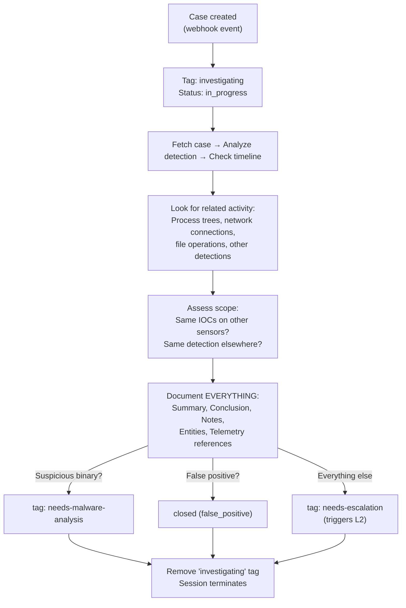

# L1 Investigator - Systematic Evidence Gathering

The workhorse of the SOC. When Triage creates a case, the L1 Investigator picks it up and performs a systematic investigation: pulling timelines, analyzing process trees, checking for IOCs, assessing scope, and documenting everything.

## What It Does

## Downstream Signaling

The L1 Investigator communicates with other SOC agents through case tags:

| Tag Added | Triggers | When |
|-----------|----------|------|
| `needs-malware-analysis` | Malware Analyst | Suspicious binary found that needs deep forensic analysis |
| `needs-escalation` | L2 Analyst | Everything that isn't a clear FP |

## API Key Permissions

Create an API key named `soc-l1-investigator` with these permissions:

| Permission | Why |
|-----------|-----|
| `org.get` | Basic org context |
| `sensor.list` | List sensors in the org |
| `sensor.get` | Get sensor details |
| `sensor.task` | Task sensors for timeline, process trees |
| `dr.list` | List D&R rules for detection context |
| `insight.det.get` | List and read detections |
| `insight.evt.get` | Access event data for IOC searches |
| `investigation.get` | Read cases |
| `investigation.set` | Update cases, add notes, entities, telemetry |
| `ext.request` | Invoke extensions |
| `org_notes.*` | Read and write org notes |
| `sop.get` | Read SOPs for operational guidance |
| `sop.get.mtd` | Read SOP metadata |
| `ai_agent.operate` | Allow the agent to run |

## Configuration

| Parameter | Value | Description |
|-----------|-------|-------------|
| `model` | `opus` | Thorough investigation requires strong reasoning |
| `max_turns` | `30` | Enough for full investigation workflow |
| `max_budget_usd` | `2.0` | Cost cap per investigation |
| `ttl_seconds` | `600` | 10 minute hard timeout |
| `one_shot` | `true` | Terminates after completing |
| Suppression | `10/min` | Max 10 agent invocations per minute |

## Files

- `hives/ai_agent.yaml` - Agent definition with investigation prompt
- `hives/dr-general.yaml` - D&R rule: triggers on case `created` webhook event
- `hives/secret.yaml` - Placeholder secrets
