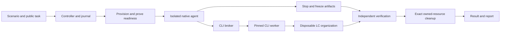

# Implemented architecture

This describes the current Python implementation. Use [Running evals](RUNNING.md) for operations and [Adding evals](ADDING_EVALS.md) for changes.

## One trial

The journal records `planned → provisioning → ready → running → stopping → settling → verifying → cleaning → finished`. Failure paths enter cleanup and retain the error and partial evidence. Cleanup failure is distinct from task failure and stops further scheduling.

## Code map

| Component | Current implementation |
|---|---|
| Operator interface and scenario choices | [cli.py](src/lc_eval/cli.py) |
| Scenario loading, lifecycle, dispatch, manifests and reports | [controller.py](src/lc_eval/controller.py) |
| Strict configuration and source/image pins | [models.py](src/lc_eval/models.py), [config.py](src/lc_eval/config.py) |
| Durable ownership and transitions | [journal.py](src/lc_eval/journal.py) |
| Docker isolation, worker, transport and parity | [execution/](src/lc_eval/execution/) |
| Native harness streams and usage, including the AI Sessions bridge | [adapters/](src/lc_eval/adapters/) |
| Pinned reduced AI Sessions image and local runner control plane | [workspace_build.py](src/lc_eval/execution/workspace_build.py), [workspace_runner.py](src/lc_eval/execution/workspace_runner.py) |
| Organization/key lifecycle, seeded data and independent collection | [fixtures/](src/lc_eval/fixtures/) |
| Signed output receipt storage | [receiver/](src/lc_eval/receiver/) |
| Deterministic assertions over frozen evidence | [verifiers/](src/lc_eval/verifiers/) |
| Compatibility, metrics, JSON/HTML reporting | [reporting/](src/lc_eval/reporting/) |
| Initial reference calibration and acceptance | [acceptance.py](src/lc_eval/acceptance.py) |

## Trust boundaries

The trusted local CLI bootstraps organizations and scoped candidate keys. The candidate key is supplied to a separate pinned CLI worker, not to the agent. The candidate container receives the public task, pinned docs and writable `/work`; its `limacharlie` executable forwards requests through the broker to the real CLI.

For `ai_sessions`, the candidate environment is extended with a native Go session runner built from a pinned AI Sessions commit, the matching SDK bridge and runtime plugins, and allowlisted public `lc-ai` catalogues. A loopback control plane supplies the one-shot runner protocol inside the container. It receives the cloned Claude subscription credential needed by the bridge, but no LimaCharlie credential or hosted workspace binding. `/workspace` aliases the physical `/work` directory expected by the broker boundary, while the documentation and catalogues are exposed through stable workspace paths. This reduced eval image tests the actual runner and bridge without reproducing the production image's unrelated cloud CLIs.

The broker enforces the disclosed controlled command surface, assigned organization, input-file handling, output limits and command limits. It preserves permitted native argv behavior, including safe global options and AI help. Agent and worker networks use separate restricted proxies. Subscription auth material is copied into the isolated harness environment; original host files are not mounted for mutation.

The controller, private ground truth, journal and receiver administration remain outside the agent and worker. After execution stops, deliverables are frozen before grading. Platform reads use independent authenticated HTTP via the trusted bootstrap boundary, not the candidate's answer. Routing additionally requires signed receiver evidence and a negative observation window.

## Experiment identity and outcomes

Manifests record scenario revision/hash, seed, docs and fixture digests, evaluator and tool digests, worker image, harness/model/effort, permission profile, limits, repetition and LC location. AI Sessions manifests additionally identify its source/catalogue commits, image and native runner binary; its effort is `native_default`. Reports recover legacy location only from consistent persisted organization evidence, never the current configuration.

Report task grade, execution status, evidence completeness, agent-start evidence and cleanup separately. Exclude pre-agent infrastructure failures and explicitly invalid trials from model rates without deleting their records. Preserve native cache/uncached token classes and unknown metrics. A/A comparisons require compatible manifests and paired successes before reporting efficiency differences.

## Current extension limits

The implementation is modular but not fully registry-driven. Scenario selection, permissions, fixture/reference/verifier dispatch, suite loading and milestone acceptance contain initial-scenario wiring. Some YAML fields describe intent rather than enforce policy; resolved configuration and runtime code enforce limits. New scenarios must update these points explicitly.

Claude Code, Codex and the local `ai_sessions` native runner are evaluated across eight scenarios in both bare and pinned LC-skills contexts. See the [results](README.md) for the current matrix and its limitations. The local AI Sessions adapter does not establish hosted Workspace coverage. Optional API request-budget modules exist but are not connected to the live subscription controller.
