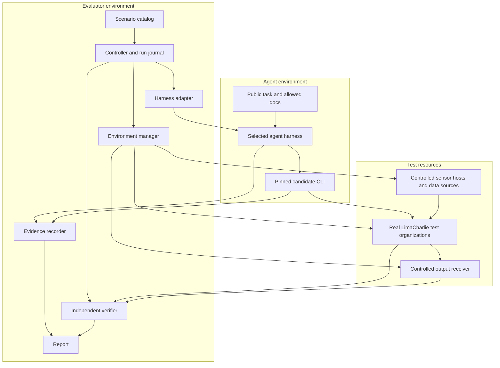

> Historical record of the initial build (2026-09-16). Do not use this as the current implementation checklist. See [running evals](../RUNNING.md) and [adding evals](../ADDING_EVALS.md).

# LimaCharlie CLI eval architecture

Status: proposed architecture, 2026-09-16. Design only. Builds on [DESIGN.md](DESIGN.md).

Implementation order, initial scenarios, resolved provisioning decisions and live acceptance criteria are specified in [IMPLEMENTATION_PLAN.md](IMPLEMENTATION_PLAN.md). That plan refines the illustrative module layout below into an installable Python package.

## Architectural decision

Build a small evaluation controller with pluggable agent runners and LimaCharlie fixture providers. Keep scenario definitions and verification independent from both. Start with a Python application in this repository, launched locally or in CI, with durable run records and isolated execution environments. Remote agents and real LimaCharlie services remain outside that process.

Python is a proposed implementation choice because the CLI and SDK already use it. It does not make the candidate CLI the verifier: install the candidate in a separate environment, and independently pin the verification client. Do not start with a new hosted service, scheduler cluster, or dashboard requirement. The first reporting interface can be generated HTML plus machine-readable results.

The controller could later run under an existing execution framework. Framework compatibility is an integration concern; it does not own task meaning, resource lifecycle, or the definition of success.

## Main components

| Component | Responsibility | Must not do |
|---|---|---|
| Scenario catalog | Define the user's goal, fixtures, requirements, budgets, expected behavior and coverage tags. | Encode a mandatory command recipe unless the task explicitly tests that command. |
| Controller | Expand experiments into trials, run the lifecycle, enforce limits, record results and recover interrupted work. | Solve the task or silently rerun an agent failure. |
| Environment manager | Lease identities/tenants/hosts, seed data, establish readiness, record resources and clean up. | Supply privileged fixture credentials to the candidate. |
| Harness adapter | Start an agent, deliver the public task, handle declared interactions, observe it and stop it. | Interpret LimaCharlie success or coach a particular harness. |
| Evidence recorder | Collect immutable controller observations, CLI/process events, harness traces and external receipts. | Treat an agent-authored log as authoritative proof. |
| Verifier | Check resulting state, behavior, scope and requested deliverables against the task contract. | Trust a completion claim or require the reference command sequence. |
| Reporter | Combine verified outcomes and measured effort into trial, capability and comparison reports. | Hide excluded tasks, missing telemetry or failed cleanup. |

These are module boundaries, not seven separately deployed services.

## Execution and trust boundaries



The evaluator owns the answer data, fixture identities, resource ledger and verification logic. The candidate receives only the task, declared documentation, authorized credentials and target resources. It does not get the development checkout, grader files, source history, or earlier trial artifacts.

For locally launched harnesses, use an isolated candidate container and an independent evaluator process/container. A sensor fixture may need a VM or dedicated host; it is not assumed to run inside the candidate container. A remote Workspace trial uses a fresh session with an equivalent declared environment. The evaluator still checks outcomes externally.

The adapter must attest or report the actual CLI version, image, docs, plugins, tools, permission configuration, memory policy and model configuration. If the remote runner cannot install the requested CLI or reset memory, it cannot enter a comparison requiring those capabilities. It can still participate in a separately labeled supported profile.

## Scenario package and its two views

One scenario package contains:

- Stable task ID, revision, capability tags and supported environment requirements.
- A public task template and a seeded generator for names, timestamps and target identities.
- Fixture specification and readiness conditions.
- Allowed access, mutation scope, user-interaction policy and resource/time/cost limits.
- Assertions about state, behavior, preservation and requested artifacts.
- Completion/convergence deadlines and cleanup ownership.
- A known-good reference execution for authoring validation.

Compilation produces two distinct views:

**Candidate view:** user request, necessary facts and files, documented permissions and constraints, docs, and credential handles. Every graded requirement must be inferable from this view.

**Evaluator view:** fixture ground truth, expected identities/result sets, hidden probes, privileged resource handles, and grader logic. It remains outside the candidate environment.

A fixture seed makes the test data reproducible. It does not make model responses or live services deterministic. For comparisons, use equivalent logical datasets in separate tenants; map generated IDs to logical fixture names when comparing outcomes.

## Harness adapter contract

Each adapter supports a small lifecycle:

1. **Describe capabilities:** local/remote execution, environment pinning, files, fresh sessions, tool traces, usage, interactions and termination.
2. **Prepare:** create the candidate environment and return its actual configuration manifest.
3. **Start:** submit the public task with a trial ID and budget.
4. **Observe:** stream normalized events and retain the original harness trace.
5. **Respond:** provide facts or approval decisions defined by the task's interaction policy, when needed.
6. **Stop and collect:** terminate execution, collect artifacts and report whether shutdown was confirmed.

Normalized events include task delivery, assistant message, tool invocation/result, process start/end where available, usage update, artifact creation, error and completion. Preserve timestamps, source IDs and provenance. Repeated deliveries are deduplicated; sequence gaps remain visible. Unsupported metrics remain null with an explanation.

An adapter transports a task; it never translates it into a better prompt or a set of commands. Harness-specific system scaffolding is recorded as part of that harness.

## Trial lifecycle

An experiment is a collection of trials. A trial is one scenario variant, one configuration, and one attempt in a fresh environment.

The normal lifecycle is:

`planned → provisioning → ready → running → stopping → settling → verifying → cleaning → finished`

- **Provisioning:** acquire resource leases and seed fixtures. Record a cleanup handle immediately after each successful creation.
- **Ready:** probe that required permissions, services and data are available; record the baseline state before releasing the prompt.
- **Running:** start the agent and measure its work. Enforce wall time independently of agent cooperation. Enforce model spend where the harness supports it, and report measurement lag or budget overshoot.
- **Stopping:** end the session and its child processes, or revoke trial access if termination cannot be confirmed. Record actions attempted beyond the deadline.
- **Settling:** allow already-submitted operations to converge within task-specific bounds. Continue observing audit trails and receipts. Do not grant the agent more execution time.
- **Verifying:** query independent state and evidence, run declared probes, and grade artifacts and completion claims.
- **Cleaning:** revoke credentials, remove/reconcile owned resources, and verify teardown. Run this path after errors and timeouts too.

Use a durable journal and resource ledger so a controller restart can reclaim resources and finalize interrupted trials. Do not transparently resume a half-finished agent attempt as a fresh valid trial. Record the interruption; any retry is a new linked trial.

A local durable store can hold lifecycle records and cleanup leases; append-only event/artifact files hold larger evidence. A reconciliation command handles overdue leases and cleanup failures. Hosted scheduling can be added when concurrency demands it.

Keep execution status, task grade, evidence completeness and cleanup status separate. A correctly completed task can have an infrastructure cleanup failure. A task can finish normally but fail every assertion. An unconfirmed shutdown can make verification inconclusive. None of these should collapse into a misleading single exit code.

## Environment providers and fixture strategy

Environment providers compose reusable resources: organization, identity, endpoint, event dataset, webhook sink, cloud account, mailbox, and subordinate AI session. They expose provision, readiness, baseline snapshot and cleanup operations.

Default mutable tasks use fresh organizations. A resettable pool is an optimization only for fixture families with verified reset behavior. Account-wide, organization-creation and external-provider tasks require broader leases and explicit concurrency limits. Name prefixes alone are insufficient for tenant isolation.

The platform stays real, while surrounding stimuli are controlled:

- Inject known events through supported ingestion paths.
- Exercise real sensor enrollment on controlled hosts.
- Receive outgoing events at a collector indexed by trial and correlation ID.
- For retrieval tasks, establish known cloud/email findings using supported ingest paths or stable test accounts. Do not assume arbitrary finding injection exists. Fixture feasibility must be demonstrated per product; missing support is an explicit architecture dependency.
- Test provider onboarding separately with real test-account credentials, so a retrieval task does not depend on fresh provider setup.

Use the fixed authenticated host LimaCharlie CLI for trusted organization lifecycle and setup, as requested by the user. Acquire short-lived evaluator tokens privately through that CLI for independent SDK/HTTP verification. A reference CLI solution is useful to establish agent solvability, but fixture provisioning should not vary with the candidate CLI being compared.

## Observability and the CLI-only boundary

Collect three evidence streams: harness actions/usage, candidate CLI execution, and platform-side state/audit/receipts. Correlate them by trial, organization, resource identity and time window. Count each CLI invocation, even if one shell call launches many commands. Keep raw observed usage and derived metrics distinct.

An executable wrapper can collect arguments, exit status, duration and output volume, but a PATH wrapper alone cannot enforce CLI-only access or guarantee complete telemetry. An agent with shell access and credentials may bypass it.

For strict CLI comparisons, isolate the CLI execution and credential boundary from the agent-controlled process: an instrumented command runner executes the unmodified pinned CLI against LC, with direct LC credentials/egress unavailable to the agent. Preserve normal arguments, stdin, stdout, stderr, exit codes and necessary file transfer semantics. The same boundary must apply to every compared harness, and its overhead must be measured.

This mechanism needs a compatibility prototype, particularly for remote Workspace, streaming, files and interactive commands. It is a proposed requirement, not an existing capability claim. If only observational access is available, label the trial accordingly; do not claim enforced CLI-only comparability. Native-product runs may use the normal environment with declared tools and attributed access paths.

Authoritative telemetry lives outside the writable candidate filesystem. Redact secrets in exported traces; retain protected evidence only where necessary for diagnosing credential-disclosure assertions. Never put credentials directly into task templates or tracked result files.

## Verification contract

An assertion returns pass, fail or unknown, with observed/expected values, evidence references and an explanation. Assertion categories are required outcomes, forbidden effects, behavioral probes, and requested deliverables.

For a routing task, independent checks inspect the output definition, inject matching and nonmatching events, and inspect the receiver. Negative checks require a healthy receiver, a positive control and a defined observation window; finite observation cannot prove that an event will never arrive. Report exactly the bounded property tested.

For a complete export, compare the exported identity set with the fixture's expected set, including items beyond the first page and excluding distractors. File formatting is graded only if the task requested a format.

Final snapshots detect missing or changed resources; audit/event evidence detects transient forbidden actions. Where the platform does not expose enough audit evidence, mark that assertion's observability limitation explicitly instead of inferring that no action occurred.

The final pass requires all mandatory outcomes and invariants. Unknown evidence produces an inconclusive result where it prevents judgment. Stage-level results explain partial completion. Failure attribution is a separate diagnosis supported by traces, not something a failed assertion automatically proves.

## Storage and reports

Proposed source layout:

```text
lc-ai/evals/
  DESIGN.md
  ARCHITECTURE.md
  catalog/          # capabilities and suite membership
  scenarios/        # task packages and public files
  fixtures/         # reusable environment recipes
  adapters/         # agent harness integrations
  verifiers/        # independent assertions and probes
  controller/       # lifecycle, limits, journal, cleanup
  reporting/        # metrics and comparison views
```

Run records/artifacts live in a configurable data directory or object store outside tracked source. Each trial retains the resolved manifest, public prompt, event log, agent deliverables, before/after evidence, assertions, usage and cleanup record. Reports link failures to concrete evidence. Preserve grader revision so archived evidence can be regraded where sufficient; probes that were never recorded require a new run.

The main views are a capability coverage table, per-trial diagnosis and paired configuration comparison. Aggregate within capability families before reporting overall averages, and always show counts/exclusions. Version suite membership and weights to keep score history interpretable.

## First architectural validation

Before expanding the task catalog, prove the complete lifecycle with a small set of representative tasks: a Hive update preserving unrelated state, a complete paginated query/export, and ingestion routed to a controlled receiver. Run an equivalent task through two harness adapters, then through Workspace once environment and telemetry parity are established.

Validate four difficult boundaries early: remote CLI version control, independent outcome evidence, fixture cleanup after interruption, and CLI-only access instrumentation. Also validate one sensor-host fixture and the feasibility of seeding Cloud Security retrieval data. These checks determine implementation feasibility; they are not an excuse to shrink the eventual capability scope.

The implementation plan turns these boundaries into concrete interfaces and selects the initial fixture methods. The user has authorized disposable LC organization lifecycle, a temporary HTTPS receiver and a $50 model budget for implementation testing. No live resources or model trials were created while writing these design documents.
