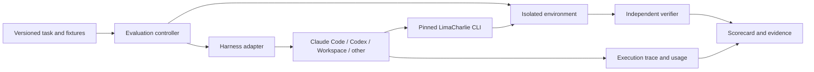

> Historical record of the initial build (2026-09-16). Do not use this as the current implementation checklist. See [running evals](../RUNNING.md) and [adding evals](../ADDING_EVALS.md).

# LimaCharlie CLI agent evaluation — high-level design

Status: proposal for discussion, 2026-09-16. No implementation or environment provisioning is part of this draft.

The concrete component boundaries and trial lifecycle are described in [ARCHITECTURE.md](ARCHITECTURE.md).

The start-to-end build and live acceptance handoff is [IMPLEMENTATION_PLAN.md](IMPLEMENTATION_PLAN.md), including the user's confirmed local-CLI provisioning, harness and budget decisions.

## Purpose

Measure how reliably and efficiently an AI agent can accomplish a user's LimaCharlie operations through the CLI in `python-limacharlie`. The evaluated system is the combination of model, agent harness, CLI, documentation, skills, and environment. Record these separately so experiments can isolate a change to one component.

The central question is: **given a concrete operational objective, does the agent produce the correct platform behavior, within scope, with reasonable time and cost?**

Security decisions are supplied by the task. For example, ask the agent to retrieve every open finding satisfying explicit criteria and create cases with specified fields; do not ask it to discover the most serious attack. For D&R, supply the intended matching behavior and representative events. For remediation, specify the authorized targets and action. The agent must translate intent into LimaCharlie operations, not independently judge threats.

## Repository observations informing this proposal

- The [CLI registry](../../../python-limacharlie/limacharlie/cli.py) covers administration, ingestion, sensors, D&R, search, configuration, cloud security, email security, vulnerabilities, cases, Apps, and AI operations. The [documentation navigation](../../../documentation/mkdocs.yml) provides the complementary product inventory.
- The CLI exposes discovery, concept help, `--ai-help`, schemas, output formats, and filtering/projection. These are experimental variables as well as resources the agent can use. See the [CLI overview](../../../python-limacharlie/doc/cli/README.md) and [ergonomics tests](../../../python-limacharlie/tests/unit/test_cli_ergonomics.py).
- [Existing integration tests](../../../python-limacharlie/tests/integration/test_cli_comprehensive.py) provide useful setup and operation examples. Passing invocation-level tests does not establish that an agent can discover and complete a user's workflow.
- [Cloud Security](../../../documentation/docs/cloud-security/cli.md) explicitly spans dedicated commands, Hive configuration, and generic API access. Its full exports differ from CSV formatting of a single result page. These are useful real-world eval cases.
- [Email Security](../../../documentation/docs/email-security/cli.md) distinguishes previews, confirmed actions, and `alert_only` outcomes. A successful request is not necessarily a completed remediation.
- [Workspace runner documentation](../../../documentation/docs/9-ai-sessions/runner-environment.md) describes bundled tools, docs, and plugins. The [Workspace protocol](../../../ai-sessions/internal/runner/workspace_protocol.go) includes memory configuration and turn usage summaries, but public context events explicitly exclude raw provider traces. An adapter will need appropriate execution telemetry, not just the conversation projection.

These links assume the current sibling-repository checkout layout. Implementation should pin source revisions and provide portable documentation links.

## Evaluation architecture

Keep the LimaCharlie task definitions and grading independent from the agent harness and execution framework.

The controller prepares fixtures, checks readiness, launches a trial, enforces its budget, captures evidence, grades, and cleans up. The harness adapter starts/stops an agent, supplies its prompt and workspace, handles declared user interactions, and exports results. It must not contain task-solving hints or LimaCharlie-specific success logic.

Adapters can be local process adapters or remote service adapters. Each declares supported capabilities: pinned CLI installation, files, credentials, session reset, interaction handling, cancellation, trace export, and usage reporting. Any harness satisfying the required contract can participate. A missing capability is reported explicitly rather than silently changing the task.

Do not depend on private model reasoning. Capture observable messages, commands, results, artifacts, and platform effects. Missing token data is unknown, not zero.

Harbor is a candidate execution backend: it documents custom agents and separate verifiers. Evaluate its fit before selecting it, especially for remote Workspace runs and external tenant lifecycle. The task corpus and LC verifier should remain usable without it. See [Harbor custom agents](https://docs.harborframework.com/core-concepts/agents/custom-agents) and [separate verifiers](https://docs.harborframework.com/core-concepts/tasks/separate-verifier).

## Scope and coverage

Maintain a capability catalog linking product capabilities to CLI surfaces, scenarios, verifiers, fixture requirements, and supported versions. Track dedicated commands, generic CLI paths, and unavailable capabilities separately. A missing CLI surface is a coverage gap to expose, not a task to silently omit or blame on the agent.

| Capability family | Representative outcome |
|---|---|
| Identity and tenant lifecycle | Create an organization in the requested location, select it, configure access, and demonstrate that subsequent changes reach the correct tenant. |
| Administration and fleet operations | Manage users, groups, keys, settings, quotas, usage and audit; operate across an explicit tenant set. |
| Endpoint onboarding and management | Create installation keys, enroll controlled endpoints, verify telemetry, apply tags/policies, task sensors, and inspect results. |
| Ingestion | Configure external/cloud adapters, ingestion credentials, parsing and routing; prove a supplied event becomes searchable. |
| Outputs and integrations | Subscribe/configure an extension, store a secret reference, route selected data, and verify receipt at a controlled destination. |
| D&R and automation | Implement supplied matching requirements, test positive and negative fixtures, deploy, replay, manage false positives and schedules, and observe the requested response. |
| Data retrieval | Search LCQL, retrieve events, pivot by supplied indicators, stream or export complete results, and handle time windows/pagination correctly. |
| Configuration and IaC | Manage Hive, secrets, lookups, playbooks, notes and SOPs; export/apply configuration, preserve unrelated state, reconcile drift, and repeat idempotently. |
| Endpoint supporting services | Manage artifacts, payloads, YARA, integrity, logging and exfiltration settings; verify specified collection or task behavior. |
| Cloud Security | Connect providers; retrieve/filter/triage findings; query inventory, graph, paths, identity, data posture, compliance and CAASM; ingest code results; manage policy/SLA/saved queries; roll up fleet data. |
| Vulnerability management | Retrieve the complete asset/finding set matching supplied package, severity and scope criteria; perform supported lifecycle operations. |
| Email Security | Configure provider/policy, inspect coverage/messages/reports, backtest supplied rules, preview an action, execute the authorized member set, and verify action status. |
| Cases and operational records | Create/update cases, attach correct evidence, assign/change status, and avoid duplicate or unrelated updates. |
| AI services and Apps | Configure agent definitions, skills, memory and budgets; start/inspect/terminate sessions; deploy a supplied App definition and verify its configuration. |

This catalog is the route to comprehensive coverage, not a claim that the first release tests every command or provider. Cover connector protocol/authentication families plus provider-specific semantics, then grow the provider matrix. Console-only features remain documented exclusions from a CLI eval.

Cross every family with applicable challenges: discoverability, create/read/update/delete, no-op/idempotency, scale/pagination, errors/recovery, asynchronous completion, tenant selection, and preservation of unrelated state. Use risk-based combinations rather than a full Cartesian product.

## Task portfolio

Use three complementary task types:

1. **Focused tasks:** one operational objective, independently seeded. Examples: retrieve a complete paginated export; update one Hive field without removing siblings; recover from an invalid parameter using help.
2. **Workflows:** several related capabilities. Examples: onboard an endpoint and prove telemetry; connect an input to a filtered output; deploy a supplied automation and prove both its positive and negative behavior.
3. **Journeys:** create a tenant, onboard infrastructure, connect ingestion/output, automate, query results, and perform a requested rollback. These expose accumulated context and dependency failures.

Workflow stages also get standalone tasks with pre-seeded starting states. Otherwise an early onboarding failure hides every downstream capability. Report journey completion and stage outcomes without treating dependent stages as independent samples.

Each task specifies its user-visible objective, supplied domain decisions, allowed actions, starting conditions, documentation profile, budgets, required end state, behavior probes, forbidden side effects, and teardown ownership. Verifier criteria must follow from the prompt or declared policies; only fixture answers and verification implementation are hidden.

Keep the prompt stable across CLI versions. State the goal rather than teaching a particular command sequence. A known-good reference execution proves feasibility and validates the verifier, but is not the only accepted solution.

Add variants with realistic distractors, duplicate display names, multiple tenants, multi-page datasets, pre-existing correct state, partial setup, transient failures, delayed ingestion, and insufficient permission. In a declared blocked task, correct completion means accurately reporting the blocker without unauthorized changes. Unexpected missing permissions in an ordinary task are setup failures.

Default tasks are self-contained. Tasks that intentionally require clarification use scripted facts and consistent response rules across harnesses; they do not receive ad hoc human coaching.

## Environments and isolation

Use the real CLI against isolated real LimaCharlie organizations as the primary integration benchmark, with controlled dependencies:

- Disposable or resettable organizations, a dedicated test identity, scoped credentials, and resource ownership recorded per trial. Tenant-creation tasks require a separate identity/cleanup model from ordinary org-scoped tasks.
- Ephemeral sensor hosts, deterministic event producers, known datasets, controlled webhook receivers, and provider test accounts where required.
- Known fixture timestamps and bounded data windows; readiness probes before the agent starts and bounded convergence checks after asynchronous actions.
- Explicit recording of backend release/feature configuration where observable; flag backend drift when exact pinning is unavailable.
- Independent teardown even when the agent crashes, resource leases/expiry, and cleanup verification. Agent-requested rollback is graded separately from controller cleanup.

Use a smaller deterministic environment for fast CLI discovery/configuration/recovery tests and injected faults. It must run the actual CLI and maintain coherent state, not replay one expected command sequence. Avoid initially building a simulator of the entire platform. Keep simulated and live scores separate, and validate simulated behavior against the live API.

For cloud-provider onboarding, test real connectivity in a dedicated integration lane. Seed known cloud findings for retrieval/triage tasks so those tasks do not depend on scanner timing or its ability to find a vulnerability. Likewise, AI-session lifecycle tasks should use a controlled subordinate workload; its cybersecurity reasoning should not influence the parent agent's score.

Agent workspaces must exclude verifier code, ground-truth manifests, reference solutions, other trials, and backend source. This development checkout is for authoring, not the evaluated agent's filesystem. Give agents only the declared docs and tools. Record outside-network policy, isolate memory/caches between trials, and keep authoritative verification credentials outside the agent environment.

## Grading

Prefer deterministic checks of authoritative state and observed behavior. This follows the outcome/state approach used by [tau-bench](https://arxiv.org/abs/2406.12045). Grade semantic equivalence, not exact command order, arbitrary names, or response formatting.

Use an independent API/SDK reader or service-side evidence rather than the candidate CLI's own formatted output as the sole oracle. For integrations, inspect destination receipt; for onboarding, observe sensor enrollment and telemetry; for asynchronous remediation, inspect completed action state. A zero exit code or saved configuration is insufficient when the task requires behavior.

Check intermediate effects as well as final state: changing an unrelated tenant and then restoring it is still a scope violation. Hidden post-task probes can test additional matching/nonmatching events, but must exercise the visible task requirements.

Return task success plus a diagnostic vector:

- Required outcomes achieved and optional stage-level partial credit.
- Scope/preservation invariants, including unauthorized changes and credential disclosure.
- Evidence accuracy: resource IDs, counts, retrieved sets, and unsupported completion claims.
- Efficiency and recovery measurements.

Hard task invariants gate overall success. Partial credit explains progress; it cannot convert a wrong-tenant operation into success. Freeze invariant definitions and any aggregation weights before comparisons.

Use LLM judging only for limited qualitative aspects such as explanation clarity, with explicit rubrics and human calibration. Operational completion should not depend on whether a model likes the answer. Test graders themselves against a known-good run, incomplete results, plausible false success, duplicate objects and forbidden side effects.

## Measurement and CLI optimization

Report a scorecard, not only one composite number:

| Dimension | Measurements |
|---|---|
| Effectiveness | Full success rate, per-family rates, journey completion, explicit coverage denominator. |
| Reliability | Repeated-trial success distribution; all-of-k success where consistency matters; uncertainty intervals. |
| Efficiency | Tokens, model cost, active execution time, time to verified completion, CLI invocations, backend requests, output bytes and measured context consumption where available. |
| Friction | Invalid commands/arguments, help lookups, repeated errors, parsing repairs, redundant requests, generic API fallback. |
| Recovery | Success after declared injected faults, time/cost to recover, duplicate mutations. |
| Operational correctness | Scope violations, unrelated changes, missed pagination, incorrect completion claims. |

Count CLI invocations and backend operations separately from shell tool calls: one shell call can contain many commands. Separate model time, platform convergence time, harness startup and fixture setup. Native token accounting differs across providers; preserve cache accounting and report cost assumptions. Output bytes provide an additional comparable measure but are not a substitute for tokens actually consumed.

Compare efficiency on paired tasks where both variants succeed, alongside overall success and total spend across all trials. This avoids making a failing agent appear efficient merely because it stops early. Reference executions provide practical baselines, not mandatory command-count minima. Sensible verification and help use are not automatically waste.

For CLI A/B tests, hold harness/model, task seed, docs/skills profile, tool availability, permissions and budgets constant. Change the CLI version only; bundled CLI help naturally changes with it. Test accompanying documentation or skill changes as separate interventions. Interleave runs to reduce time-of-day/backend effects, repeat trials, and report paired deltas with uncertainty clustered by task family/template.

Maintain development tasks, held-out scenario families, and a regression suite. Merely changing names in the same template is not a strong holdout. Promote real operational failures into reviewed regression tasks. Interpret failures as agent, CLI, documentation, harness, platform, fixture or verifier issues only when evidence supports that attribution; allow unknown.

Always report setup errors, timeouts, skipped/unsupported tasks and infrastructure-invalid trials. Predefine invalidation criteria and rerun policy, retain original attempts, and avoid selectively rerunning failures until they pass.

These efficiency measures and held-out comparisons draw on [Anthropic's tool evaluation guidance](https://www.anthropic.com/engineering/writing-tools-for-agents). Task isolation, reference solutions, calibrated grading and repeated trials follow its [agent evaluation guidance](https://www.anthropic.com/engineering/demystifying-evals-for-ai-agents).

## Comparison profiles

- **Controlled CLI profile:** the same CLI, docs snapshot, shell/file tools and starting context across harnesses. All LimaCharlie operations go through the CLI, including its generic API command. Local scripts may orchestrate CLI calls; direct SDK/HTTP/MCP access to LC is outside this profile. Enforce/observe the boundary, rather than relying solely on a prompt.
- **Native product profile:** each harness uses its normal plugins, skills and supported tools. Record them all. This measures the user experience of that configured product and cannot by itself establish which CLI version is better.
- **Discovery variants:** CLI help alone; CLI plus docs; CLI plus docs and a pinned skill bundle. Run these as explicit experiments, not a mandatory multiplication of every task.

Default to fresh sessions and cleared persistent memory. Long-running and memory-enabled use cases are separate declared tasks. Record all delegated/nested agent cost if delegation is enabled. Workspace acts as an adapter target here; managing Workspace through the CLI is a separate platform capability task.

## Worked scenario

User objective: create an isolated tenant in the specified region, onboard the supplied Linux host with tag `eval-linux`, ingest the supplied JSON feed, and forward only events whose `environment` is `production` to the supplied receiver. Preserve an existing unrelated output. Demonstrate completion with resource IDs and evidence.

The controller supplies an authorized test identity, host access, feed, destination and region. The agent receives no command recipe. The verifier checks tenant ownership/location, enrollment and tags, searchable fixture events, matching event receipt, nonmatching-event exclusion, and preservation of the existing output. Correlation IDs distinguish this trial's effects from old data.

Focused variants begin with a pre-created tenant or a broken adapter. Journey variants require the entire chain. The task supplies the matching requirement; no cybersecurity judgment is involved.

## Proposed delivery shape and next design decisions

Keep design, capability catalog, tasks, fixtures, adapters, verifiers and report definitions under `lc-ai/evals/`. Store run artifacts outside the tracked source tree, with redacted traces and manifests identifying versions, seeds and environment settings.

Start with a calibration slice of roughly 20–30 focused tasks and 3–5 workflows across administration, sensor onboarding, ingestion/output, D&R, queries and Cloud Security. Include at least one case for pagination, asynchronous completion, idempotency, and error recovery. These are proposed starting sizes, not statistical sufficiency claims or a substitute for the full catalog.

Before scaling, demonstrate that reference runs pass, flawed runs fail for the intended reasons, fixtures reset cleanly, adapters receive equivalent tasks, and a controlled CLI change produces interpretable evidence. Extend across every catalog family and provider lane as fixtures become available.

The next discussion should settle the first task catalog and success criteria, the live test environment/account model, the default comparison profile, and acceptable per-run time/cost. Framework selection and an implementation plan follow those decisions.
