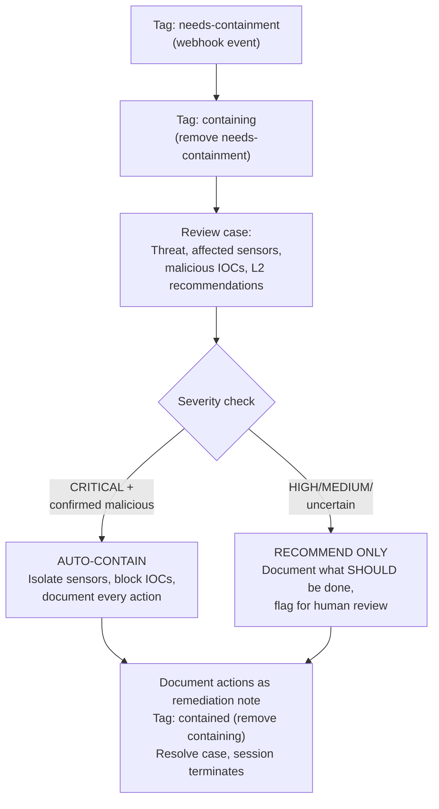

# Containment - Automated Threat Response

Takes action on confirmed threats. When L2 tags a case with `needs-containment`, this agent isolates compromised sensors and blocks malicious IOCs. For critical severity threats, it acts automatically. For everything else, it documents recommended actions for human review.

## What It Does

## Containment Actions

| Action | Command | When |
|--------|---------|------|
| Sensor Isolation | `limacharlie sensor isolate` | Critical severity, confirmed malicious |
| Block Hash | Add to `soc-blocked-hashes` lookup | Any confirmed malicious hash |
| Block IP | Add to `soc-blocked-ips` lookup | Any confirmed malicious IP |
| Block Domain | Add to `soc-blocked-domains` lookup | Any confirmed malicious domain |

**Note**: The lookup tables (`soc-blocked-hashes`, `soc-blocked-ips`, `soc-blocked-domains`) must exist in the org. Create them manually or via IaC. D&R rules should reference these lookups to enforce blocking.

## Safety Guardrails

- Only auto-contains **CRITICAL severity** cases with confirmed malicious IOCs
- HIGH/MEDIUM/LOW severity cases get **documented recommendations only**
- Every action is logged as a case note **before** execution
- Conservative by default: when in doubt, recommend instead of acting

## API Key Permissions

Create an API key named `containment` with these permissions:

| Permission | Why |
|-----------|-----|
| `org.get` | Basic org context |
| `sensor.list` | List sensors for isolation |
| `sensor.get` | Get sensor details |
| `sensor.task` | Isolate sensors |
| `investigation.get` | Read cases |
| `investigation.set` | Update cases, add notes |
| `ext.request` | Invoke extensions |
| `org_notes.*` | Read and write org notes |
| `ai_agent.operate` | Allow the agent to run |
| `lookup.set` | Add IOCs to block lookup tables |

## Configuration

| Parameter | Value | Description |
|-----------|-------|-------------|
| `model` | `sonnet` | Containment follows clear rules, doesn't need deep reasoning |
| `max_turns` | `30` | Enough for review + action |
| `max_budget_usd` | `1.0` | Low budget -- mostly executing commands |
| `ttl_seconds` | `300` | 5 minute hard timeout |
| `one_shot` | `true` | Terminates after completing |
| Suppression | `1 per case/30min` | Max one containment per case per 30 minutes |

## Files

- `hives/ai_agent.yaml` - Agent definition with containment prompt
- `hives/dr-general.yaml` - D&R rule: triggers on `tags_updated` containing `needs-containment`
- `hives/secret.yaml` - Placeholder secrets
