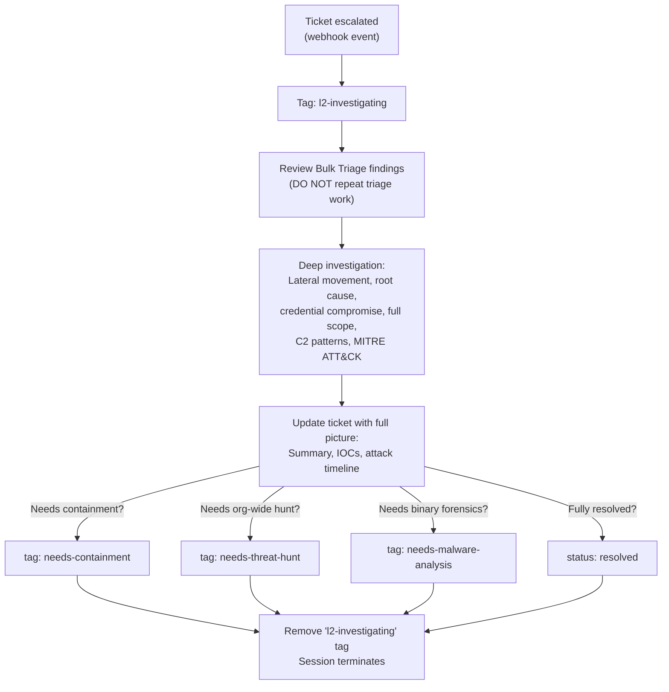

# L2 Analyst - Deep Investigation and Scope Assessment

The senior analyst. Only sees tickets that the Bulk Triage agent has escalated as suspicious or malicious. Goes deep: lateral movement hunting, root cause analysis, full scope assessment, and MITRE ATT&CK mapping. Decides whether to trigger containment, threat hunting, or malware analysis downstream.

## What It Does

## Downstream Signaling

| Tag Added | Triggers | When |
|-----------|----------|------|
| `needs-containment` | Containment | Confirmed malicious, endpoints need isolation or IOCs need blocking |
| `needs-threat-hunt` | Threat Hunter | Confirmed IOCs that should be hunted org-wide |
| `needs-malware-analysis` | Malware Analyst | Binary needs deep forensic analysis (if Bulk Triage didn't already tag it) |

## API Key Permissions

Create an API key named `soc-l2-analyst` with these permissions:

| Permission | Why |
|-----------|-----|
| `org.get` | Basic org context |
| `sensor.list` | List and search sensors org-wide |
| `sensor.get` | Get sensor details |
| `sensor.task` | Task sensors for timeline, process trees |
| `dr.list` | List D&R rules for context |
| `insight.det.get` | List and read detections org-wide |
| `insight.evt.get` | Access event data for IOC searches |
| `investigation.get` | Read tickets |
| `investigation.set` | Update tickets, add notes, entities, telemetry |
| `ext.request` | Invoke extensions |
| `ai_agent.operate` | Allow the agent to run |

## Configuration

| Parameter | Value | Description |
|-----------|-------|-------------|
| `model` | `opus` | Deep analysis requires strong reasoning |
| `max_turns` | `50` | More turns for org-wide investigation |
| `max_budget_usd` | `5.0` | Higher budget for thorough analysis |
| `ttl_seconds` | `900` | 15 minute hard timeout |
| `one_shot` | `true` | Terminates after completing |
| Suppression | `1 per ticket/30min` | Max one L2 session per ticket per 30 minutes |

## Files

- `hives/ai_agent.yaml` - Agent definition with deep investigation prompt
- `hives/dr-general.yaml` - D&R rule: triggers on ticket `escalated` webhook event
- `hives/secret.yaml` - Placeholder secrets
