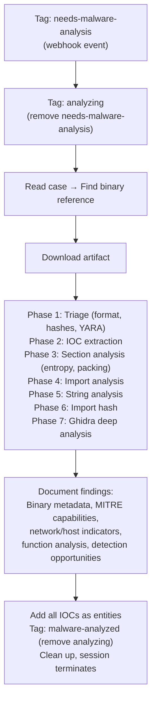

# Malware Analyst - Binary Forensics Specialist

A specialist agent that only activates when another SOC agent tags a case with `needs-malware-analysis`. Performs deep static analysis of suspicious binaries using LCRE and Ghidra, extracts IOCs, maps to MITRE ATT&CK, and documents detection opportunities.

## What It Does

## Why This Is a Separate Agent

Malware analysis is expensive ($5.00, 15 minutes) and only needed when a suspicious binary is actually found. Running this on every detection would be wasteful. By making it a specialist triggered by a tag, it only runs when Bulk Triage or L2 specifically identifies a binary that needs analysis.

## API Key Permissions

Create an API key named `malware-analyst` with these permissions:

| Permission | Why |
|-----------|-----|
| `org.get` | Basic org context |
| `sensor.list` | List sensors to find artifacts |
| `sensor.get` | Get sensor details |
| `sensor.task` | Request memory dumps and file collections from live sensors |
| `insight.det.get` | Read detections on case |
| `insight.evt.get` | Access event data, download and list artifacts |
| `investigation.get` | Read cases |
| `investigation.set` | Update cases, add notes, entities |
| `payload.ctrl` | Download payloads for analysis |
| `ext.request` | Invoke extensions |
| `ai_agent.operate` | Allow the agent to run |

## Configuration

| Parameter | Value | Description |
|-----------|-------|-------------|
| `model` | `opus` | Deep binary analysis requires strong reasoning |
| `max_turns` | `50` | Many phases of analysis |
| `max_budget_usd` | `5.0` | Higher budget for thorough forensics |
| `ttl_seconds` | `900` | 15 minute hard timeout |
| `one_shot` | `true` | Terminates after completing |
| Suppression | `1 per case/30min` | Max one analysis per case per 30 minutes |

## Prerequisites

The AI session environment must have `lcre` (LimaCharlie Reverse Engineering CLI) installed. This is included in the standard LimaCharlie AI session container.

## Files

- `hives/ai_agent.yaml` - Agent definition with malware analysis prompt
- `hives/dr-general.yaml` - D&R rule: triggers on `tags_updated` containing `needs-malware-analysis`
- `hives/secret.yaml` - Placeholder secrets
