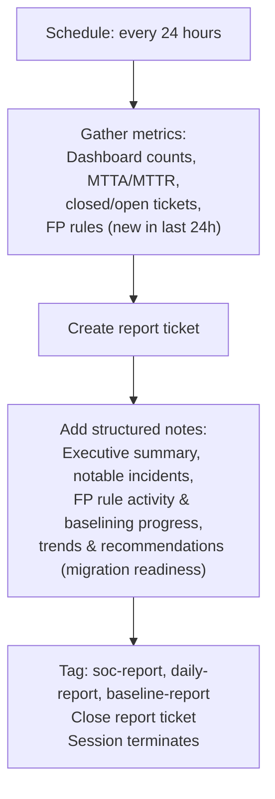

# Shift Reporter - Daily SOC & Baselining Metrics

Runs once per day to generate a comprehensive SOC report. In addition to the standard metrics (ticket volume, MTTA/MTTR, severity breakdown), it reports on FP rule activity -- the primary output of the Baselining SOC -- and assesses whether the organization is ready to migrate to the Tiered SOC.

## What It Does



## Report Contents

The daily report covers:

**Key Metrics:**
- Total alerts processed, tickets created/closed
- False positive vs true positive breakdown
- Mean Time to Acknowledge (MTTA)
- Mean Time to Resolve (MTTR)
- SLA breach count
- Open backlog by severity
- FP rules created (24h) and total active

**Notable Incidents:**
- Critical and high severity true positives
- Containment actions taken
- Threat hunts conducted
- Tickets still requiring human attention

**FP Rule Activity:**
- New FP rules created in the last 24 hours (names, categories, conditions)
- Total active FP rules
- Detection volume trends (is noise decreasing?)
- Categories still generating the most noise

**Trends and Recommendations:**
- Detection categories with highest volume
- False positive rate observations
- Detection tuning suggestions
- Emerging threat patterns
- Baselining progress assessment (ready for Tiered SOC migration?)

## Finding Reports

Reports are created as tickets tagged with `soc-report`, `daily-report`, and `baseline-report`, then immediately closed. To find them:

```bash
limacharlie ticket list --tag baseline-report --oid <oid> --output yaml
```

## API Key Permissions

Create an API key named `soc-shift-reporter` with these permissions:

| Permission | Why |
|-----------|-----|
| `org.get` | Basic org context |
| `investigation.get` | List tickets, read dashboard, get report summary |
| `investigation.set` | Create report ticket, add notes |
| `ext.request` | Invoke extensions |
| `fp.ctrl` | List FP rules for baselining progress reporting |
| `ai_agent.operate` | Allow the agent to run |

## Configuration

| Parameter | Value | Description |
|-----------|-------|-------------|
| `model` | `sonnet` | Report compilation doesn't need deep reasoning |
| `max_turns` | `30` | Enough to gather metrics and write report |
| `max_budget_usd` | `1.0` | Moderate budget for report generation |
| `ttl_seconds` | `300` | 5 minute hard timeout |
| `one_shot` | `true` | Terminates after completing |
| Schedule | `24h_per_org` | Runs every 24 hours per organization |

## Files

- `hives/ai_agent.yaml` - Agent definition with reporting prompt (includes FP rule and baselining metrics)
- `hives/dr-general.yaml` - D&R rule: triggers on `24h_per_org` schedule event
- `hives/secret.yaml` - Placeholder secrets
