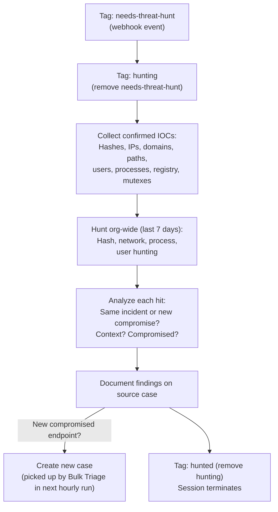

# Threat Hunter - Proactive IOC Hunting

The proactive arm of the SOC. When L2 confirms malicious IOCs and tags a case with `needs-threat-hunt`, this agent hunts across the entire organization for related compromise -- lateral movement, additional affected endpoints, and the same IOCs appearing on other sensors.

## What It Does

## Why Threat Hunting Matters

A single detection usually reveals one endpoint. But attackers rarely compromise just one machine. The Threat Hunter closes the gap between "we found it on one endpoint" and "we found it everywhere it exists."

New cases created by the Threat Hunter will be reviewed in the next Bulk Triage cycle, ensuring findings are properly assessed and tracked.

## API Key Permissions

Create an API key named `threat-hunter` with these permissions:

| Permission | Why |
|-----------|-----|
| `org.get` | Basic org context |
| `sensor.list` | List and search sensors org-wide |
| `sensor.get` | Get sensor details |
| `sensor.task` | Task sensors for additional context |
| `insight.det.get` | List and read detections org-wide |
| `insight.evt.get` | Access event data for IOC hunting |
| `investigation.get` | Read cases |
| `investigation.set` | Update cases, create new cases, add notes |
| `ext.request` | Invoke extensions |
| `org_notes.*` | Read and write org notes |
| `ai_agent.operate` | Allow the agent to run |

## Configuration

| Parameter | Value | Description |
|-----------|-------|-------------|
| `model` | `opus` | Broad hunting requires strong reasoning |
| `max_turns` | `50` | Many IOCs to hunt, many sensors to check |
| `max_budget_usd` | `5.0` | Higher budget for thorough hunting |
| `ttl_seconds` | `900` | 15 minute hard timeout |
| `one_shot` | `true` | Terminates after completing |
| Suppression | `1 per case/30min` | Max one hunt per case per 30 minutes |

## Files

- `hives/ai_agent.yaml` - Agent definition with hunting prompt
- `hives/dr-general.yaml` - D&R rule: triggers on `tags_updated` containing `needs-threat-hunt`
- `hives/secret.yaml` - Placeholder secrets
