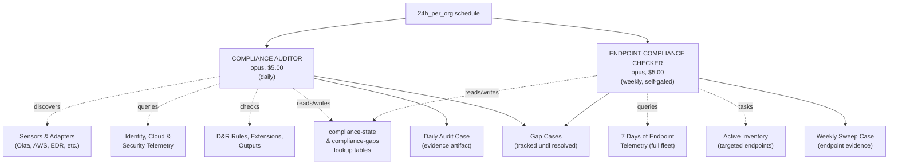

# Compliance SOC — Continuous Compliance Posture Management

Automated compliance monitoring across SOC 2, ISO 27001, PCI-DSS v4, and CIS v8. Two agents continuously verify that security controls exist, are operating, and produce evidence that auditors can use directly.

## Architecture



## How It Works

The compliance SOC doesn't run a fixed checklist — it **discovers what the org has connected** and adapts its analysis accordingly. An org with Okta + AWS + 200 Windows endpoints gets different checks than one with Azure AD + GCP + 50 Linux servers.

| Step | Agent | What Happens |
|------|-------|-------------|
| 1 | **Compliance Auditor** (daily) | Discovers all sensors and adapters, verifies data flow, analyzes identity/cloud/EDR/collaboration telemetry for compliance-relevant events, calculates framework scores, tracks gaps |
| 2 | **Endpoint Compliance Checker** (weekly) | Full fleet LCQL sweep across 8 compliance checks (services, accounts, software, FIM, network, drivers), active inventory on targeted endpoints |

### What Gets Created

- **Daily audit cases** — closed with structured notes per control area. Each daily case is a point-in-time compliance evidence artifact. A year of these proves continuous monitoring to auditors.
- **Weekly sweep cases** — closed with fleet-wide endpoint compliance findings.
- **Gap cases** — dedicated cases for each compliance gap, tracked until resolved. The auditor updates existing gap cases daily rather than creating duplicates.
- **Lookup tables** — `compliance-state` (metrics/trends) and `compliance-gaps` (active gap inventory with case references).

### Framework Selection via SOP

Organizations configure which frameworks to assess and scope rules via a `compliance-frameworks` SOP (stored in the `sop` hive). If no SOP exists, all four frameworks are assessed with all sensors in scope.

Example SOP content:
```
Frameworks: SOC 2, PCI-DSS v4
PCI scope limited to sensors tagged "pci-scope"
Audit period: Jan 1 - Dec 31 2026
Auditor: Deloitte — they emphasize change management evidence
```

### Compliance Scoring

Each framework score is a weighted average of control domain scores. Checks score PASS (100), PARTIAL (50), FAIL (0), or N/A (excluded). Domains with no relevant data source are excluded from scoring and reported separately as coverage gaps — this prevents misleading low scores when data sources simply aren't connected yet.

### Gap Tracking

When a gap is found, the agent creates a dedicated case for it and tracks the mapping in a lookup table. On subsequent runs, the agent updates the existing gap case with current status instead of creating duplicates. When a gap resolves, the case is closed with a resolution note.

## Cost Profile

| Agent | Frequency | Model | Budget/Run | Monthly Cost |
|-------|-----------|-------|------------|-------------|
| Compliance Auditor | Daily | opus | $5.00 | ~$150/mo |
| Endpoint Compliance Checker | Weekly | opus | $5.00 | ~$20/mo |
| **Total** | | | | **~$170/mo** |

## Agents

| Agent | Role | Model | Budget | TTL | Trigger |
|-------|------|-------|--------|-----|---------|
| [compliance-auditor](compliance-auditor/) | Daily posture assessment across all connected data sources | opus | $5.00 | 15m | Schedule: every 24h |
| [endpoint-compliance-checker](endpoint-compliance-checker/) | Weekly full fleet endpoint compliance sweep | opus | $5.00 | 15m | Schedule: every 24h (self-gates to weekly) |

## Installation Order

1. **compliance-auditor** — starts producing daily compliance evidence
2. **endpoint-compliance-checker** — starts weekly endpoint sweeps

## Prerequisites

1. **ext-cases extension** must be subscribed and configured with a webhook
2. **Anthropic API key** with access to Claude Opus
3. **Per-agent LimaCharlie API keys** with appropriate permissions (see agent READMEs)
4. **Recommended**: ext-integrity extension (FIM) for file integrity monitoring checks
5. **Recommended**: Identity provider adapter (Okta, Azure AD) for access control evidence
6. **Recommended**: Cloud audit adapter (AWS CloudTrail, GCP) for infrastructure evidence

## API Key Permissions

### compliance-auditor

| Permission | Why |
|-----------|-----|
| `org.get` | Basic org context |
| `sensor.list` | Discover all sensors and adapters |
| `sensor.get` | Sensor details and health |
| `dr.list` | Check D&R rule coverage |
| `dr.list.managed` | Check managed rulesets |
| `insight.evt.get` | LCQL queries for compliance data |
| `insight.det.get` | Detection statistics |
| `insight.stat` | Query statistics |
| `ext.request` | Create cases via ext-cases |
| `ext.conf.get` | List extensions and subscriptions |
| `investigation.get` | Read cases |
| `investigation.set` | Update cases, add notes, manage tags |
| `output.list` | Check output configuration |
| `lookup.get` | Read compliance state and gaps |
| `lookup.set` | Update compliance state and gaps |
| `audit.get` | Read audit events |
| `ai_agent.operate` | Allow the agent to run |

### endpoint-compliance-checker

| Permission | Why |
|-----------|-----|
| `org.get` | Basic org context |
| `sensor.list` | Discover EDR endpoints |
| `sensor.get` | Sensor details and health |
| `sensor.task` | Active inventory collection on targeted endpoints |
| `insight.evt.get` | LCQL queries for fleet-wide compliance sweep |
| `insight.stat` | Query statistics |
| `ext.request` | Create cases via ext-cases |
| `ext.conf.get` | Check if ext-integrity is subscribed |
| `investigation.get` | Read cases |
| `investigation.set` | Update cases, add notes, manage tags |
| `lookup.get` | Read compliance state and gaps |
| `lookup.set` | Update compliance state and gaps |
| `ai_agent.operate` | Allow the agent to run |

## Data Sources & Framework Coverage

The more data sources connected to LimaCharlie, the more comprehensive the compliance coverage:

| Data Source | Compliance Value | Frameworks |
|-------------|-----------------|------------|
| **EDR Endpoints** (Windows/Linux/macOS) | Asset inventory, process monitoring, FIM, detection coverage | All |
| **Okta / Azure AD / Entra ID / Duo** | Access control, MFA, privileged access, account lifecycle | SOC 2 CC6, ISO A.9, PCI 7-8, CIS 5-6 |
| **AWS CloudTrail / GCP / Azure** | Infrastructure changes, IAM, encryption, public access | SOC 2 CC6/CC8, ISO A.9/A.13, PCI 1-2/7, CIS 3-6 |
| **Office 365 / GitHub / Slack** | Data protection, admin changes, external sharing | SOC 2 CC6.7, ISO A.13, PCI 3-4, CIS 3 |
| **ext-integrity (FIM)** | File integrity monitoring proof | PCI 11.5, SOC 2 CC6.1, CIS 3, ISO A.12 |
| **ext-cases** | Incident response metrics, SLA compliance | SOC 2 CC7, ISO A.16, PCI 12, CIS 17 |

## Files

```
compliance-soc/
├── README.md                                  # This file
├── compliance-soc.yaml                        # Master include file
├── compliance-auditor/
│   ├── README.md                              # Auditor agent docs
│   └── hives/
│       ├── ai_agent.yaml                      # Agent definition
│       ├── dr-general.yaml                    # 24h schedule trigger
│       └── secret.yaml                        # API key placeholders
└── endpoint-compliance-checker/
    ├── README.md                              # Checker agent docs
    └── hives/
        ├── ai_agent.yaml                      # Agent definition
        ├── dr-general.yaml                    # 24h schedule trigger (weekly self-gate)
        └── secret.yaml                        # API key placeholders
```
