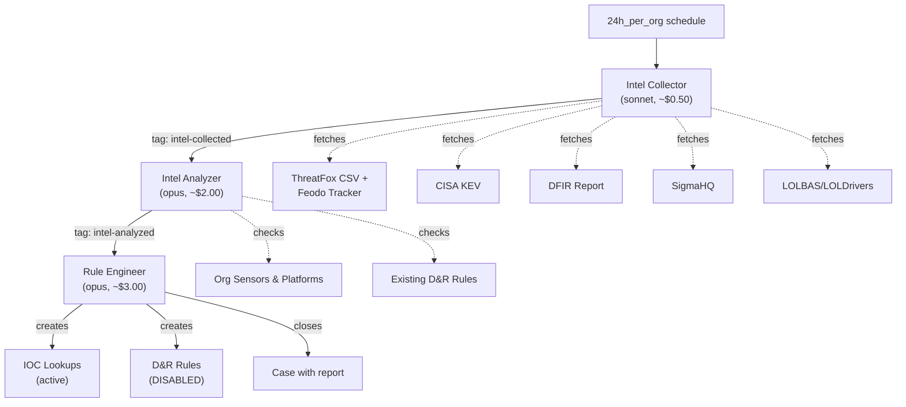

# Intel SOC - Automated Threat Intelligence Pipeline

A 3-agent pipeline that runs daily to collect open-source threat intelligence, analyze it against your org's actual platform profile, and produce detection rules and IOC lookups.

## Architecture



## How It Works

| Step | Agent | What Happens |
|------|-------|-------------|
| 1 | **Intel Collector** | Pulls from 5 threat intel sources daily, creates a case with raw intel |
| 2 | **Intel Analyzer** | Discovers org platforms, extracts IOCs/TTPs, filters by relevance, maps to ATT&CK |
| 3 | **Rule Engineer** | Populates IOC lookups, generates D&R rules (disabled), documents everything in the case |

### What Gets Created

- **IOC Lookups** (`intel-ioc-hashes`, `intel-ioc-domains`, `intel-ioc-ips`, `intel-ioc-urls`) — immediately active, can be matched by existing or new D&R rules
- **D&R Rules** — created in **disabled state** with names like `intel-sigma-t1059-encoded-powershell`. A human reviews and enables them.
- **Case** — closed with full report: what was collected, what was analyzed, what rules/lookups were created, with rules referenced by name (not full content)

### Platform-Aware Analysis

The Intel Analyzer checks what sensors and platforms are actually deployed in the org before recommending rules. If you only have Windows endpoints, it won't recommend Linux-specific detections. If you have no network monitoring, it will deprioritize network IOCs.

## Intel Sources (MVP)

| Source | Type | What It Provides | Update Frequency |
|--------|------|-----------------|-----------------|
| [ThreatFox](https://threatfox.abuse.ch/) + [Feodo Tracker](https://feodotracker.abuse.ch/) | CSV exports | IOCs (C2 IPs, domains, hashes) tagged by malware family; botnet C2 IPs | Continuous |
| [CISA KEV](https://www.cisa.gov/known-exploited-vulnerabilities-catalog) | JSON feed | CVEs confirmed exploited in the wild | ~Weekly |
| [The DFIR Report](https://thedfirreport.com/) | RSS + scrape | Full intrusion case studies with IOCs and TTPs | ~Monthly |
| [SigmaHQ](https://github.com/SigmaHQ/sigma) | Git commits + raw YAML | Community detection rules with ATT&CK mappings | ~Weekly (30-day window) |
| [LOLBAS](https://lolbas-project.github.io/) / [LOLDrivers](https://www.loldrivers.io/) | Git commits | Legitimate binaries/drivers abused by attackers | ~Monthly (30-day window) |

## Inter-Agent Communication

| Tag | Meaning | Added By | Triggers |
|-----|---------|----------|----------|
| `intel-collected` | Raw intel ready for analysis | Collector | Analyzer |
| `analyzing-intel` | Analysis in progress (lock) | Analyzer | — |
| `intel-analyzed` | Analysis complete, ready for rules | Analyzer | Rule Engineer |
| `engineering-rules` | Rule creation in progress (lock) | Rule Engineer | — |
| `rules-drafted` | Rules created (completion signal) | Rule Engineer | — |
| `intel-pipeline` | Marks case as part of intel pipeline | Collector | — |
| `daily-intel` | Marks daily intel report | Rule Engineer | — |

## Cost Profile

| Agent | Model | Budget | Typical Cost |
|-------|-------|--------|-------------|
| Intel Collector | sonnet | $2.00 | ~$0.50 |
| Intel Analyzer | opus | $5.00 | ~$2.00 |
| Rule Engineer | opus | $5.00 | ~$3.00 |
| **Total per day** | | **$12.00 max** | **~$5.50** |

## Prerequisites

1. **ext-cases extension** must be subscribed and configured with a webhook
2. **Anthropic API key** with access to Claude Sonnet and Opus
3. **Per-agent LimaCharlie API keys** with appropriate permissions (see agent READMEs)

## API Key Permissions

### intel-collector

| Permission | Why |
|-----------|-----|
| `org.get` | Basic org context |
| `investigation.get` | Read existing cases |
| `investigation.set` | Create cases, add notes/tags |
| `ai_agent.operate` | Allow the agent to run |

### intel-analyzer

| Permission | Why |
|-----------|-----|
| `org.get` | Basic org context |
| `sensor.list` | Discover org platforms |
| `dr.list` | Check existing detection coverage |
| `investigation.get` | Read the intel case |
| `investigation.set` | Update case with analysis |
| `ext.request` | List extensions |
| `ai_agent.operate` | Allow the agent to run |

### intel-engineer

| Permission | Why |
|-----------|-----|
| `org.get` | Basic org context |
| `dr.set` | Create new D&R rules |
| `dr.list` | Check existing rules |
| `lookup.set` | Populate IOC lookups |
| `investigation.get` | Read the analyzed case |
| `investigation.set` | Update case with report |
| `ai_agent.operate` | Allow the agent to run |

## Installation

Deploy via the `lc-deployer` skill:
```
/lc-deployer install intel-soc to <org>
```

Or manually with `limacharlie sync push`:
```bash
limacharlie sync push --oid <oid> --input intel-soc.yaml
```

## Files

```
intel-soc/
├── README.md                          # This file
├── intel-soc.yaml                     # Master include file
├── intel-collector/
│   ├── README.md                      # Collector agent docs
│   └── hives/
│       ├── ai_agent.yaml              # Agent definition
│       ├── dr-general.yaml            # 24h schedule trigger
│       └── secret.yaml                # API key placeholders
├── intel-analyzer/
│   ├── README.md                      # Analyzer agent docs
│   └── hives/
│       ├── ai_agent.yaml              # Agent definition
│       └── dr-general.yaml            # intel-collected tag trigger
└── rule-engineer/
    ├── README.md                      # Engineer agent docs
    └── hives/
        ├── ai_agent.yaml              # Agent definition
        └── dr-general.yaml            # intel-analyzed tag trigger
```
