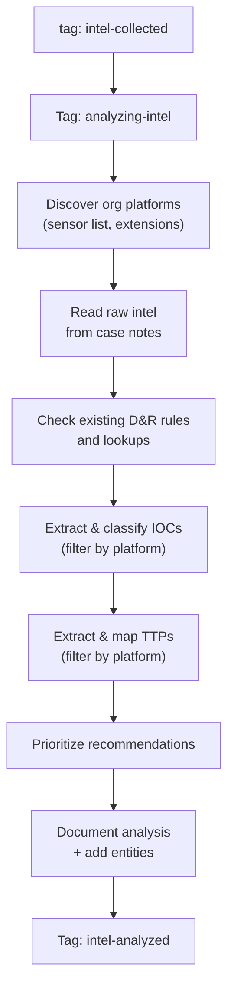

# Intel Analyzer - Platform-Aware Intelligence Analysis

Takes raw intelligence from the Collector, discovers what platforms and sensors the org actually has, then extracts and classifies IOCs/TTPs filtered by relevance. Produces a prioritized recommendation list for the Rule Engineer.

## What It Does

## Why Opus

This agent needs to reason about platform relevance, map TTPs to ATT&CK, assess existing coverage gaps, and produce structured analysis. Opus handles this well.

## Platform Filtering

The key differentiator of this agent: it checks what sensors/platforms the org actually has and filters all analysis through that lens. A Windows-only org won't get Linux rule recommendations. An org without network monitoring won't get network IOC recommendations prioritized.

## API Key Permissions

Create an API key named `intel-analyzer` with:

| Permission | Why |
|-----------|-----|
| `org.get` | Basic org context |
| `sensor.list` | Discover org platforms and sensor types |
| `dr.list` | Check existing detection rule coverage |
| `investigation.get` | Read the intel case |
| `investigation.set` | Update case with analysis, add entities/tags |
| `ext.request` | List active extensions and adapters |
| `ai_agent.operate` | Allow the agent to run |

## Configuration

| Parameter | Value |
|-----------|-------|
| `model` | `opus` |
| `max_budget_usd` | `5.00` |
| `ttl_seconds` | `900` (15m) |
| Trigger | `intel-collected` tag |
| Suppression | 1 per case per 30m |

## Files

- `hives/ai_agent.yaml` - Agent definition
- `hives/dr-general.yaml` - D&R rule: triggers on `intel-collected` tag
