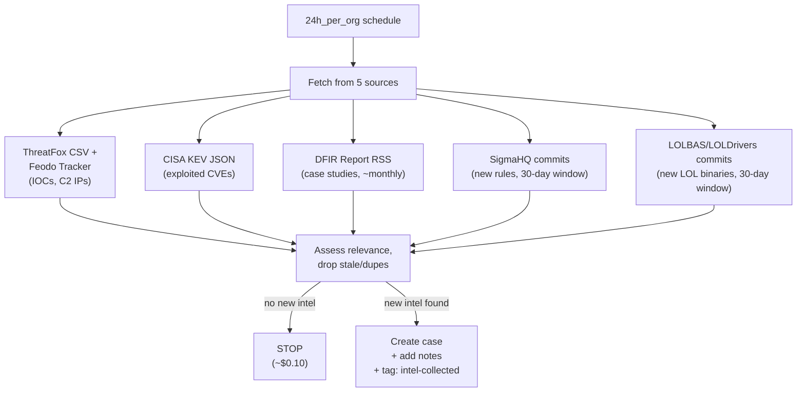

# Intel Collector - Daily Threat Intelligence Fetcher

The entry point of the intel pipeline. Runs once per day on a schedule, pulls from 5 open-source threat intel feeds, and creates a case with the raw intelligence for downstream processing.

## What It Does

## Why Sonnet

This agent is doing structured API calls and RSS parsing — no complex reasoning needed. Sonnet keeps cost low (~$0.50/run).

## API Key Permissions

Create an API key named `intel-collector` with:

| Permission | Why |
|-----------|-----|
| `org.get` | Basic org context |
| `investigation.get` | Check existing cases |
| `investigation.set` | Create cases, add notes/tags |
| `ai_agent.operate` | Allow the agent to run |

## Configuration

| Parameter | Value |
|-----------|-------|
| `model` | `sonnet` |
| `max_budget_usd` | `2.00` |
| `ttl_seconds` | `600` (10m) |
| Trigger | `24h_per_org` schedule |

## Files

- `hives/ai_agent.yaml` - Agent definition
- `hives/dr-general.yaml` - D&R rule: triggers on daily schedule
- `hives/secret.yaml` - Placeholder secrets (shared across all intel-soc agents)
