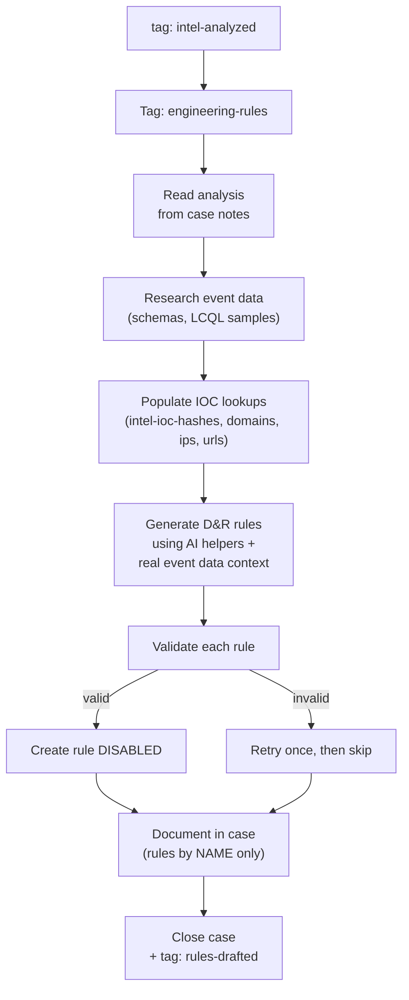

# Rule Engineer - Detection Rule & Lookup Builder

The final stage of the intel pipeline. Takes analyzed intelligence and produces concrete artifacts: IOC lookup table entries (active) and D&R detection rules (disabled, pending human review).

## What It Does

## Why Opus

Rule generation requires understanding detection logic, ATT&CK techniques, and LimaCharlie D&R syntax. Opus produces better rules and handles validation failures more gracefully.

## Key Design Decisions

### Rules Created Disabled
All D&R rules are created with `--disabled`. This is a safety mechanism — automated intel should not immediately start firing detections without human review. The case documents how to enable them.

### IOC Lookups Active
Unlike rules, IOC lookup entries are immediately active. They don't fire detections on their own — they're passive data that D&R rules can match against. The lookup-matching D&R rules themselves are also created disabled.

### Rules Referenced by Name
The case notes reference rules by their hive name (e.g., `intel-sigma-t1059-encoded-powershell`) rather than containing the full rule YAML. This keeps cases readable and avoids stale copies of rule content.

### Naming Convention
- Rules: `intel-<source>-<technique>-<descriptor>`
- Lookups: `intel-ioc-<type>` (hashes, domains, ips, urls)

## API Key Permissions

Create an API key named `intel-engineer` with:

| Permission | Why |
|-----------|-----|
| `org.get` | Basic org context and event schema access |
| `sensor.list` | Find sensors to explore event data for each platform |
| `insight.evt.get` | Research actual event data via LCQL before generating rules |
| `dr.set` | Create new D&R rules (disabled) |
| `dr.list` | Check for existing rules to avoid duplicates |
| `lookup.set` | Add IOCs to lookup tables |
| `investigation.get` | Read the analyzed case |
| `investigation.set` | Update case with report, close it |
| `ai_agent.operate` | Allow the agent to run |

## Configuration

| Parameter | Value |
|-----------|-------|
| `model` | `opus` |
| `max_budget_usd` | `5.00` |
| `max_turns` | `100` |
| `ttl_seconds` | `900` (15m) |
| Trigger | `intel-analyzed` tag |
| Suppression | 1 per case per 30m |

## Files

- `hives/ai_agent.yaml` - Agent definition
- `hives/dr-general.yaml` - D&R rule: triggers on `intel-analyzed` tag
