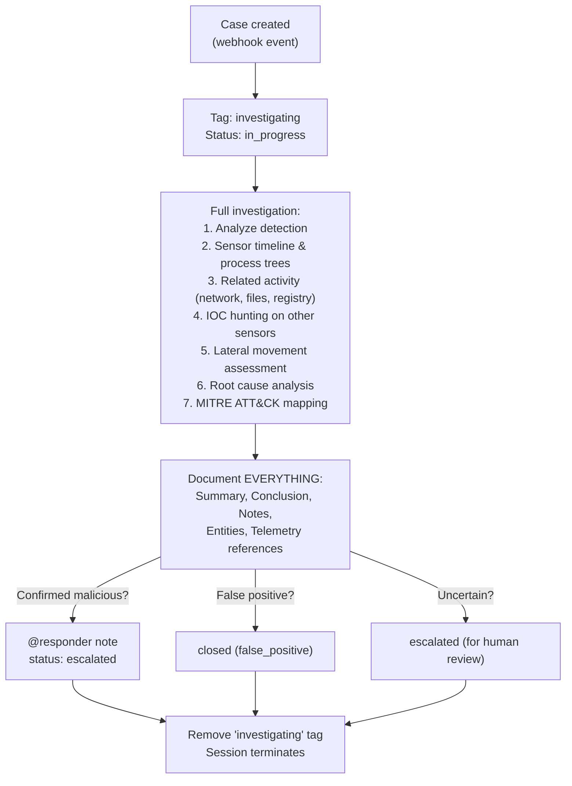

# Investigator - Full-Spectrum Analysis

The sole investigator in the Lean SOC. Combines L1 and L2 analyst roles into a single agent that handles the complete investigation lifecycle -- from initial evidence gathering through deep analysis, scope assessment, and final determination.

## What It Does

## Why One Investigator Instead of L1 + L2

In the Lean SOC, a single investigator with a higher budget ($5.00, 15 minutes) replaces the tiered L1 ($2.00) + L2 ($5.00) split. Tradeoffs:

**Advantages:**
- No handoff overhead -- full context stays in one session
- Lower total cost for true positives ($5 vs $7)
- Simpler architecture, fewer failure modes

**Disadvantages:**
- Higher per-investigation cost for false positives ($5 vs $2)
- No specialist handoff for malware analysis
- Single agent is a bottleneck during alert storms

## API Key Permissions

Create an API key named `lean-investigator` with:

| Permission | Why |
|-----------|-----|
| `org.get` | Basic org context |
| `sensor.list` | List sensors org-wide |
| `sensor.get` | Get sensor details |
| `sensor.task` | Task sensors for timeline, process trees |
| `dr.list` | List D&R rules for detection context |
| `insight.det.get` | List and read detections |
| `insight.evt.get` | Access event data for IOC searches |
| `investigation.get` | Read cases |
| `investigation.set` | Update cases, add notes, entities, telemetry |
| `ext.request` | Invoke extensions |
| `org_notes.*` | Read and write org notes |
| `sop.get` | Read SOPs for operational guidance |
| `sop.get.mtd` | Read SOP metadata |
| `ai_agent.operate` | Allow the agent to run |
| `ai_agent.exec` | Trigger downstream agents via @mention notes |

## Configuration

| Parameter | Value |
|-----------|-------|
| `model` | `opus` |
| `max_turns` | `50` |
| `max_budget_usd` | `5.0` |
| `ttl_seconds` | `900` (15m) |
| Suppression | `10/min` |

## Files

- `hives/ai_agent.yaml` - Agent definition with combined L1+L2 prompt
- `hives/dr-general.yaml` - D&R rule: triggers on case `created` webhook event
- `hives/secret.yaml` - Placeholder secrets
