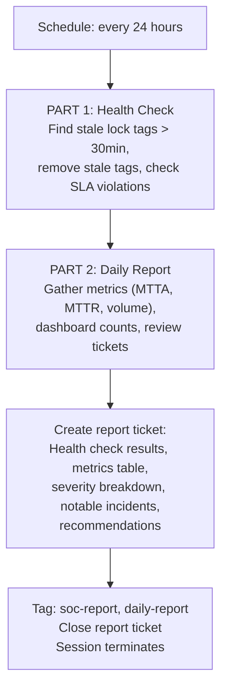

# Reporter - Daily Health Check and Metrics

Pulls double duty: performs SOC health monitoring (stale tickets, SLA violations) AND generates the daily metrics report. Combines the Tiered SOC's SOC Manager and Shift Reporter into one efficient daily run.

## What It Does



## Why Combined

In the Lean SOC, running a separate hourly health check ($0.50 x 24 = $12/day) isn't cost-effective. The Reporter runs daily and handles both health monitoring and reporting for ~$1/day. The tradeoff: stale tickets might wait up to 24 hours instead of 1 hour to be cleaned up.

## Finding Reports

```bash
limacharlie ticket list --tag soc-report --oid <oid> --output yaml
```

## API Key Permissions

Create an API key named `lean-reporter` with:

| Permission | Why |
|-----------|-----|
| `org.get` | Basic org context |
| `investigation.get` | List tickets, dashboard, report summary |
| `investigation.set` | Create report ticket, add notes/tags, clean up stale tags |
| `ext.request` | Invoke extensions |
| `ai_agent.operate` | Allow the agent to run |

## Configuration

| Parameter | Value |
|-----------|-------|
| `model` | `sonnet` |
| `max_budget_usd` | `1.0` |
| `ttl_seconds` | `300` (5m) |
| Schedule | `24h_per_org` |

## Files

- `hives/ai_agent.yaml` - Agent definition with combined health + reporting prompt
- `hives/dr-general.yaml` - D&R rule: triggers on `24h_per_org` schedule event
- `hives/secret.yaml` - Placeholder secrets
