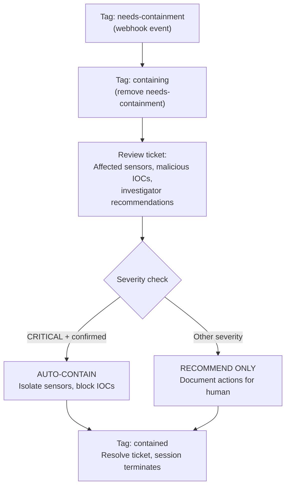

# Responder - Automated Threat Containment

Takes action on confirmed threats. When the Investigator tags a ticket with `needs-containment`, this agent isolates sensors and blocks IOCs. Auto-contains critical threats; documents recommendations for everything else.

## What It Does

## Safety Guardrails

- Auto-contains only **CRITICAL** severity with confirmed malicious IOCs
- Everything else gets **documented recommendations** only
- Every action is logged **before** execution
- Conservative by default

## API Key Permissions

Create an API key named `lean-responder` with:

| Permission | Why |
|-----------|-----|
| `org.get` | Basic org context |
| `sensor.list` | List sensors |
| `sensor.get` | Get sensor details |
| `sensor.task` | Isolate sensors |
| `investigation.get` | Read tickets |
| `investigation.set` | Update tickets, add notes |
| `ext.request` | Invoke extensions |
| `ai_agent.operate` | Allow the agent to run |
| `lookup.set` | Add IOCs to block lookups |

## Configuration

| Parameter | Value |
|-----------|-------|
| `model` | `sonnet` |
| `max_budget_usd` | `1.0` |
| `ttl_seconds` | `300` (5m) |
| Suppression | `1 per ticket/30min` |

## Files

- `hives/ai_agent.yaml` - Agent definition with containment prompt
- `hives/dr-general.yaml` - D&R rule: triggers on `tags_updated` containing `needs-containment`
- `hives/secret.yaml` - Placeholder secrets
