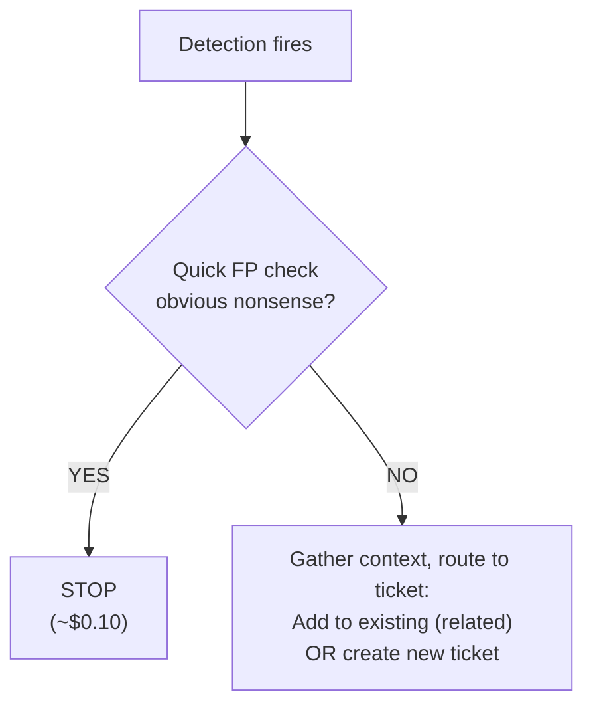

# Triage - Detection Gatekeeper

The first line of defense. Every detection passes through this agent for a quick verdict: noise or real?

## What It Does

## Why Sonnet

Runs on every detection. Sonnet keeps cost at ~$0.10/alert while filtering noise before the expensive Investigator sees it.

## API Key Permissions

Create an API key named `lean-triage` with:

| Permission | Why |
|-----------|-----|
| `org.get` | Basic org context |
| `insight.det.get` | List recent detections |
| `investigation.get` | List existing tickets |
| `investigation.set` | Create tickets, add detections/notes |
| `ext.request` | Invoke ext-ticketing |
| `ai_agent.operate` | Allow the agent to run |

## Configuration

| Parameter | Value |
|-----------|-------|
| `model` | `sonnet` |
| `max_budget_usd` | `0.50` |
| `ttl_seconds` | `300` (5m) |
| Suppression | `20/min` |

## Files

- `hives/ai_agent.yaml` - Agent definition
- `hives/dr-general.yaml` - D&R rule: triggers on every detection
- `hives/secret.yaml` - Placeholder secrets
