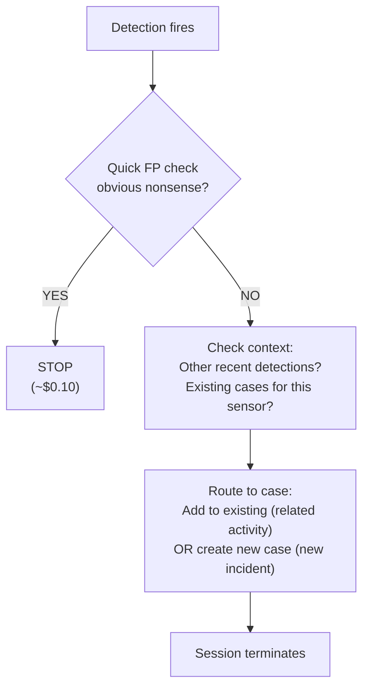

# Triage - Detection Gatekeeper

The first line of defense. Every detection that fires in the organization passes through this agent. It makes a snap judgment: is this noise, or does it deserve a case?

## What It Does

## Why Sonnet

This agent runs on every detection -- potentially hundreds per day. Sonnet keeps cost at ~$0.10/alert while being more than capable of recognizing obvious false positives and checking for existing cases. The expensive investigation work happens downstream in the L1 Investigator.

## API Key Permissions

Create an API key named `soc-triage` with these permissions:

| Permission | Why |
|-----------|-----|
| `org.get` | Basic org context |
| `insight.det.get` | List recent detections from sensor |
| `investigation.get` | List and read existing cases |
| `investigation.set` | Create cases, add detections, add notes |
| `ext.request` | Invoke ext-cases extension |
| `ai_agent.operate` | Allow the agent to run |

## Configuration

| Parameter | Value | Description |
|-----------|-------|-------------|
| `model` | `sonnet` | Fast, cost-effective triage |
| `max_turns` | `30` | Enough for context gathering + routing |
| `max_budget_usd` | `0.50` | Cost cap per session |
| `ttl_seconds` | `300` | 5 minute hard timeout |
| `one_shot` | `true` | Terminates after completing |
| Suppression | `20/min` | Max 20 agent invocations per minute |

## Files

- `hives/ai_agent.yaml` - Agent definition with triage prompt
- `hives/dr-general.yaml` - D&R rule: triggers on every detection (`target: detection`)
- `hives/secret.yaml` - Placeholder secrets
